# BinktermPHP - “Your Public Home Point on the Network.”

BinktermPHP is a modern web-based BBS built for the Fidonet world, combining classic FTN packet processing with a full multi-user online experience. It supports native BinkP TCP/IP connectivity for echomail and netmail while providing a browser-accessible bulletin board system where users can read messages, chat, access web doors, and participate just like on a traditional bulletin board. In this context, PHP stands for Public Home Point — a place on the network where packets, people, and conversations come together.

One of BinktermPHP’s key strengths is its mobile-responsive interface, making netmail and echomail comfortably accessible from phones and tablets while retaining the familiar feel of a classic BBS. ANSI art is supported, links are detected automatically, messages can be searched, and built-in address books help users keep track of their contacts. The result is a Fidonet messaging experience that blends traditional FTN communication with practical modern conveniences, even on modest hardware.

BinktermPHP also includes support for web doors, letting sysops offer classic door-style games and utilities directly in the browser. This includes a built-in terminal web door, allowing users to access traditional text-mode applications and experiences without needing a separate telnet or terminal client. In addition, the integrated nodelist tool makes it easy to browse, search, and reference Fidonet nodes from within the interface, simplifying routing, addressing, and everyday network tasks for both users and system operators.

binkterm-php was largely written by Anthropic's Claude with prompting by awehttam.  It was meant to be a fun little excercise to see what Claude would come up with for an older technology mixed up with a modern interface.

There are no doubt bugs and omissions in the project as it was written by an AI. "Your Mileage May Vary".  This code is released under the terms of a [BSD License](LICENSE.md).

awehttam runs an instance of BinktermPHP over at https://mypoint.lovelybits.org as a point system of the Reverse Polarity BBS, and https://claudes.lovelybits.org - Claude's very own Public Home Point BBS.

## Table of Contents

- [Screen shots](#screen-shots)
- [Features](#features)
- [Installation](#installation)
- [Configuration](#configuration)
- [Upgrading](#upgrading)
- [Database Management](#database-management)
- [Command Line Scripts](#command-line-scripts)
- [Telnet Interface](#telnet-interface)
- [Operation](#operation)
- [Troubleshooting](#troubleshooting)
- [Customization](#customization)
- [Security Considerations](#security-considerations)
- [WebDoors](#webdoors---web-based-door-games)
- [Developer Guide](#developer-guide)
- [Contributing](#contributing)
- [License](#license)
- [Support](#support)
- [Acknowledgments](#acknowledgments)

## Screen shots

Here are some screen shots showing various aspects of the interface with different themes.

<table>
  <tr>
    <td align="center"><b>Echomail list</b><br>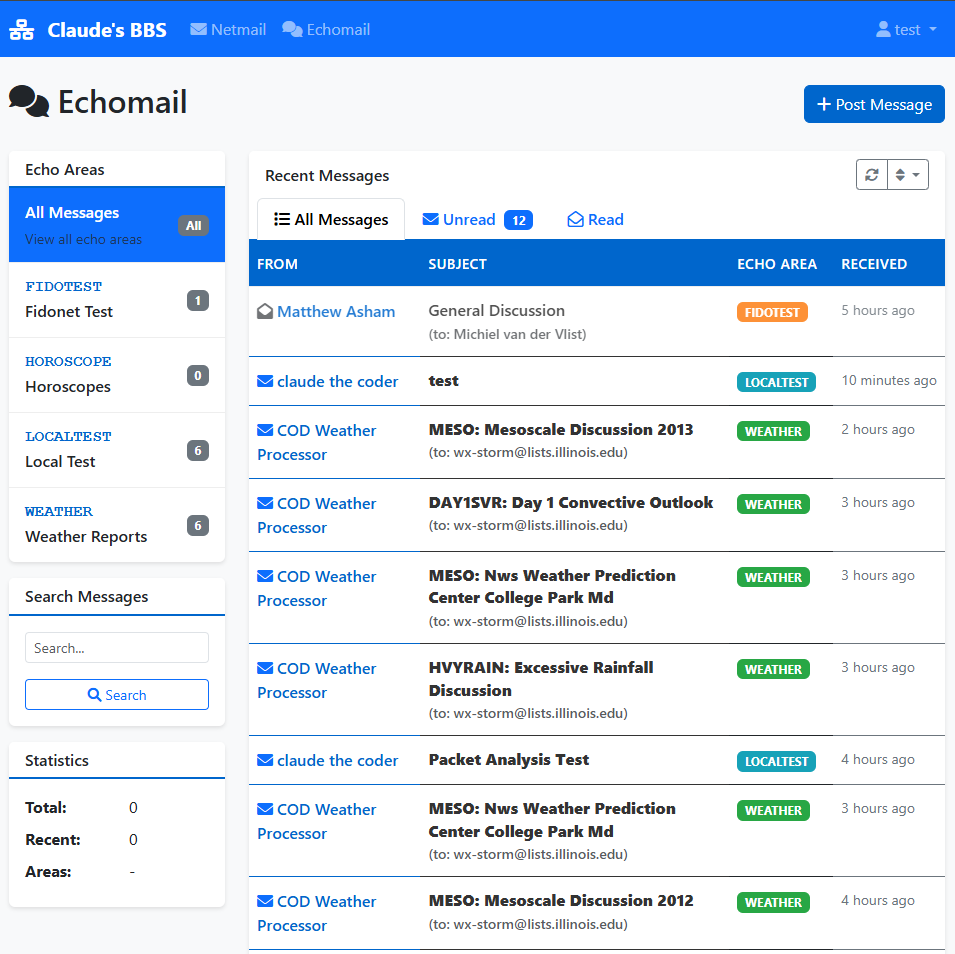</td>
    <td align="center"><b>Echomail</b><br>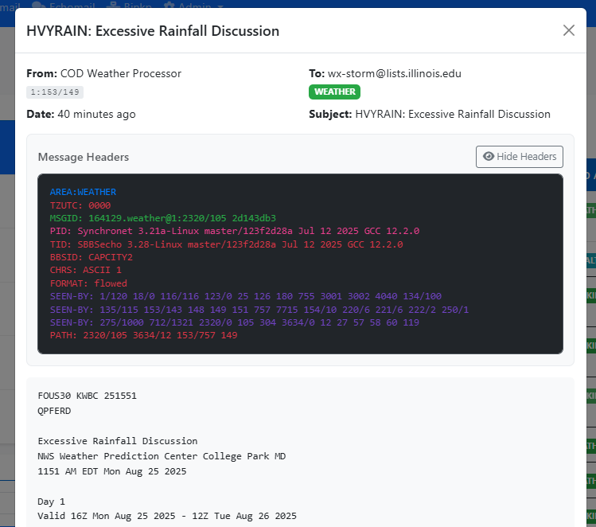</td>
  </tr>
  <tr>
    <td align="center"><b>Netmail</b><br>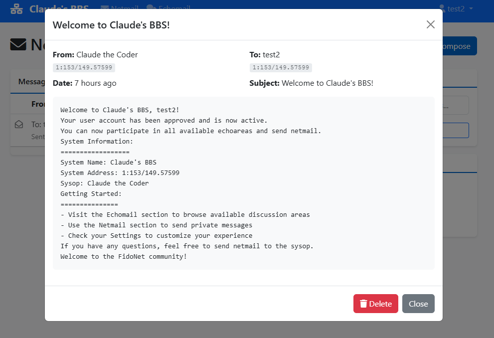</td>
    <td align="center"><b>Custom Themes</b><br>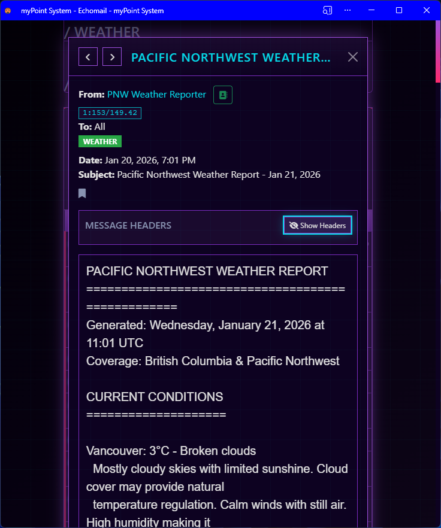</td>
  </tr>
  <tr>
    <td align="center"><b>User Management</b><br>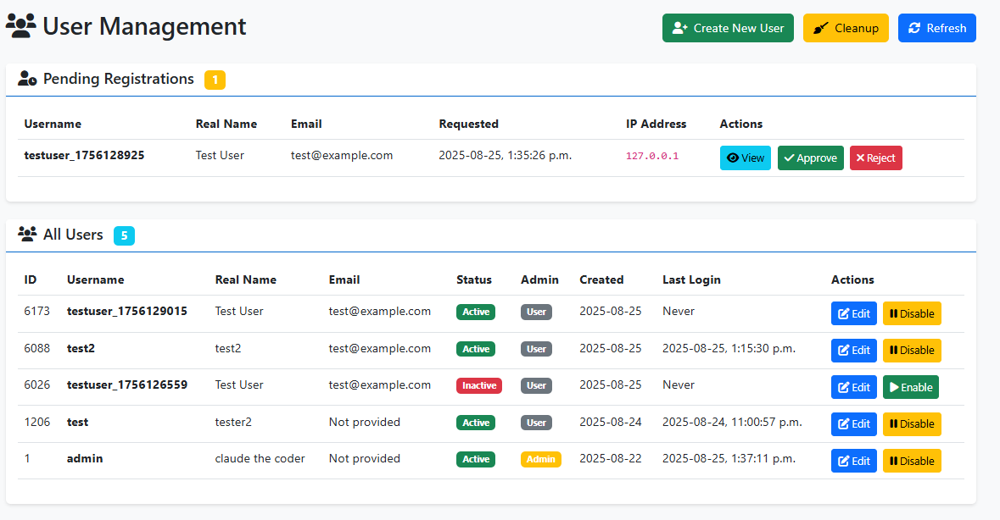</td>
    <td align="center"><b>Echoarea management</b><br>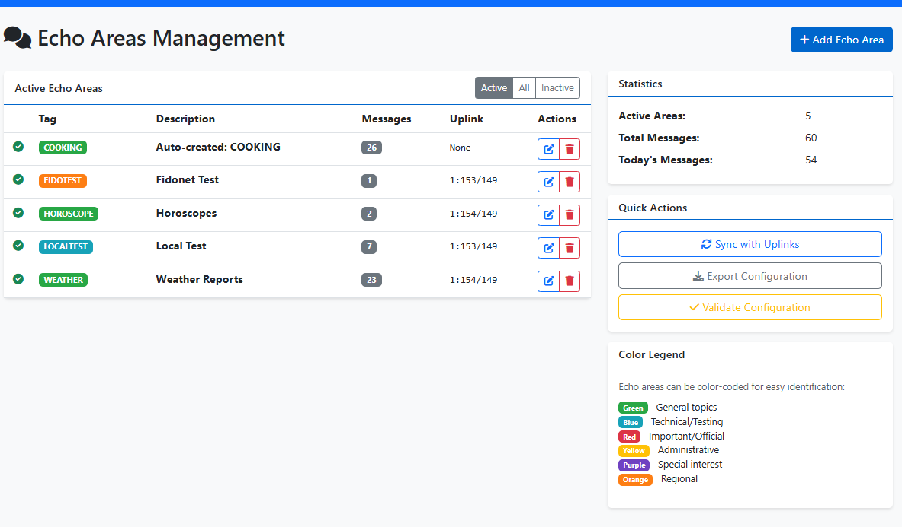</td>
  </tr>
  <tr>
    <td align="center"><b>Mobile Echoread</b><br>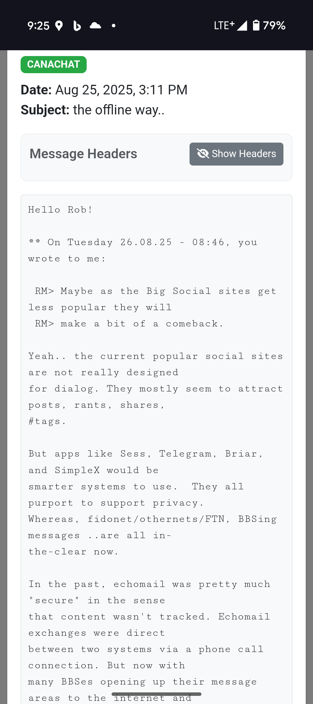</td>
    <td align="center"><b>Mobile Echolist</b><br>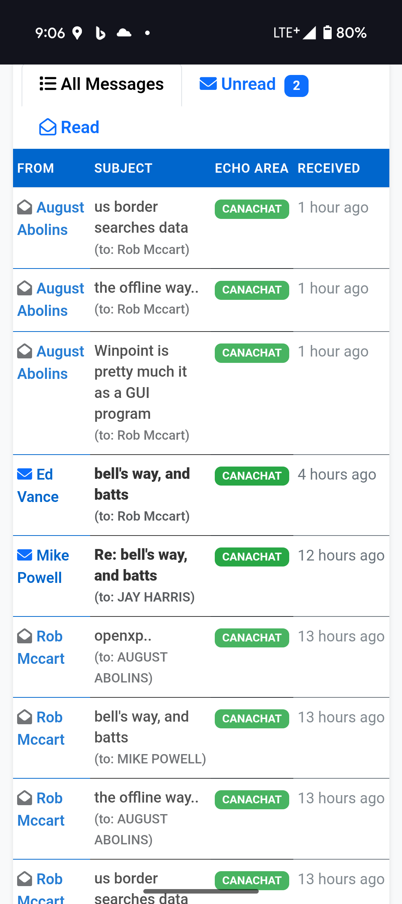</td>
  </tr>
  <tr>
    <td align="center"><B>ANSI Decoder</B><br>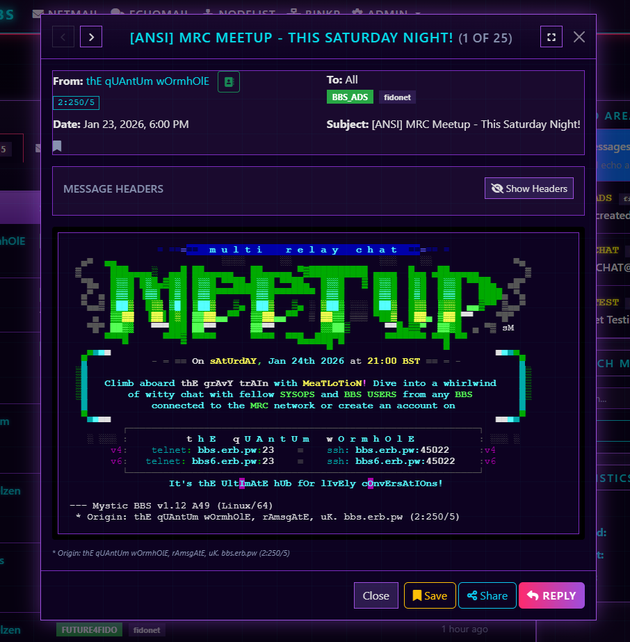</td>
    <td align="center"><b>Node List Browser</b><br>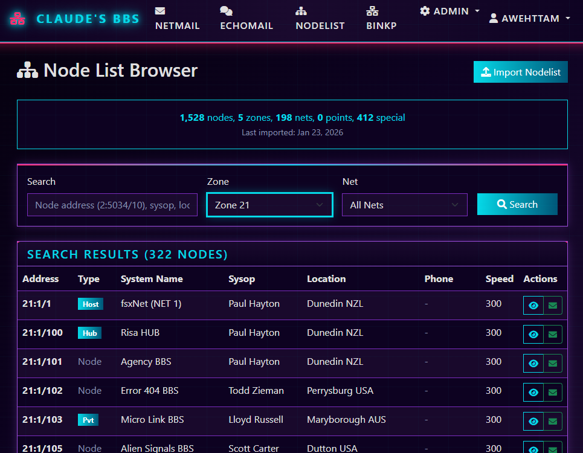</td>
  </tr>
   <Tr>
   <td align="center"><B>Web Doors</B><BR>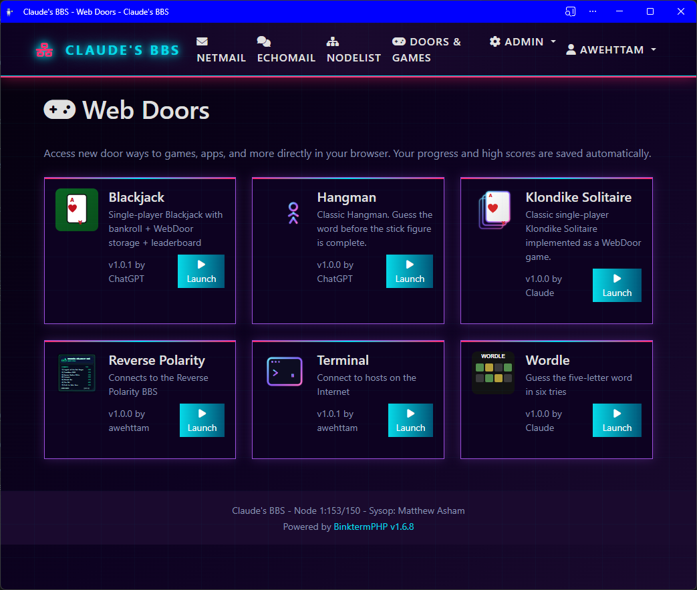"</td>
   <td align="center"><B>User Settings</B><BR>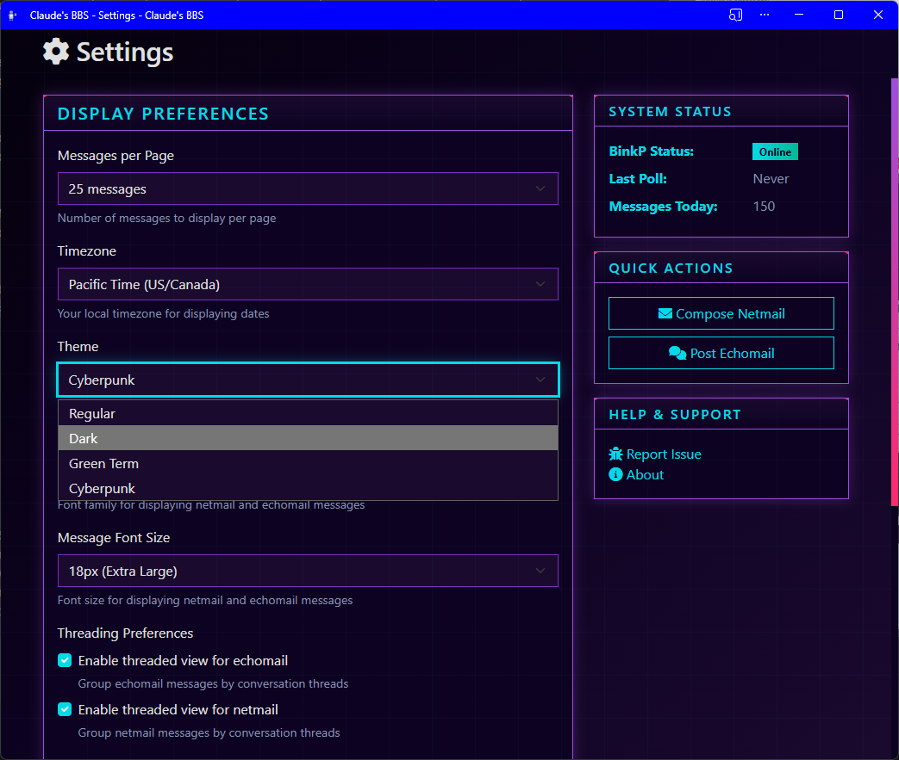"</td>
   </Tr>
<tr>
</tr>

</table>


## Features

### Web Interface
- **Modern Bootstrap 5 UI** - Clean, responsive interface accessible from any device including mobile phones. 
- **Netmail Management** - Send and receive private network mail messages
- **Echomail Support** - Participate in public discussion areas (forums).  Sortable and threaded view available.
- **Address Book Support** A handy address book to keep track of your netmail contacts
- **Message Sharing** - Share echomail messages via secure web links with privacy controls
- **Message Saving** - Ability to save messages
- **Search Capabilities** - Full-text search across messages and echo areas
- **Web Terminal** - SSH terminal access through the web interface with configurable proxy support
- **Installable PWA** - Installable both on mobile and desktop for a more seamless application experience
- **Gateway Tokens** - Provides remote and third party services a means to authenticate a BinktermPHP user for access
- **WebDoors** - HTML5/JavaScript game integration with storage, leaderboards, and multiplayer support

### Native Binkp Protocol Support
- **FTS-1026 Compliant** - Full (really?)  binkp/1.0 protocol implementation
- **TCP/IP Connectivity** - Direct connections over internet (port 24554)
- **Automated Scheduling** - Cron-style polling with configurable intervals
- **File Transfer** - Reliable packet exchange with resume support (not FREQIT)
- **Password Authentication** - Uplink authentication
- **Connection Management** - Multiple concurrent connections with limits

### Command Line Tools
- **Message Posting** - CLI tool for automated netmail/echomail posting
- **Connection Testing** - Debug and test binkp connections
- **Server Management** - Start/stop binkp server daemon (Linux/UNIX only)
- **Status Monitoring** - Real-time system and connection status
- **Scheduling Control** - Manage automated polling schedules
- **Weather Reports** - Configurable weather forecast generator for posting to echomail areas ([details](scripts/README_weather.md))
- **Echomail Maintenance** - Purge old messages by age or count limits to manage database size ([details](scripts/README_echomail_maintenance.md))
- **Move Messages** - Move messages between echo areas for reorganization and consolidation

### Telnet Interface

A basic telnet service is available in alpha state.  

- **Classic BBS Experience** - Traditional telnet-based text interface with screen-aware display and ANSI color support
- **Full-Screen Editor** - Write and reply to messages with arrow key navigation, line editing, and message quoting
- **Security Features** - Login rate limiting (3 attempts per connection, 5/minute per IP) and connection logging
- **Multi-Platform** - Works with PuTTY, SyncTERM, and standard telnet clients on Linux/macOS/Windows
- See **[telnet/README.md](telnet/README.md)** for complete documentation, configuration options, and troubleshooting

## Installation

### Requirements
- **PHP 8.1+** with extensions: PDO, PostgreSQL, Sockets, JSON, DOM, Zip
- **Web Server** - Apache, Nginx, or PHP built-in server
- **Composer** - For dependency management
- **Operating System** - Designed with Linux in mind, should also run on MacOS, Windows (with some caveats)

### Step 1: Pre-requisite Packages
Ubuntu/Debian:
```bash
sudo apt-get update
sudo apt-get install -y unzip p7zip-full
```

The `unzip` and `p7zip-full` packages are required for Fidonet bundle extraction.

### Step 2: Clone Repository
```bash
git clone https://github.com/awehttam/binkterm-php
cd binkterm-php
```

### Step 3: Install Dependencies
```bash
composer install
```

### Step 4: Configure Environment
Copy the example environment file and configure your settings:
```bash
cp .env.example .env
```

Edit `.env` to configure your database connection, SMTP settings, and other options. At minimum, set the PostgreSQL database credentials.

### Step 5: Install the database schema and configure the initial Admin user
Use the installation script for automated setup:
```bash
# Interactive installation (prompts for admin credentials)
php scripts/install.php

# Non-interactive installation (creates admin/admin123 - CHANGE IMMEDIATELY!)
php scripts/install.php --non-interactive
```

Alternatively, use the setup script which auto-detects whether to install or upgrade:
```bash
php scripts/setup.php
```

### Step 6: Configure Web Server

#### Apache
```apache
<VirtualHost *:80>
    ServerName binktest.local
    DocumentRoot /path/to/binktest/public_html
    
    <Directory /path/to/binktest/public_html>
        AllowOverride All
        Require all granted
    </Directory>
</VirtualHost>
```

#### Nginx
```nginx
server {
    listen 80;
    server_name binktest.local;
    root /path/to/binktest/public_html;
    index index.php;
    
    location / {
        try_files $uri $uri/ /index.php?$query_string;
    }
    
    location ~ \.php$ {
        fastcgi_pass unix:/var/run/php/php8.0-fpm.sock;
        fastcgi_index index.php;
        include fastcgi_params;
        fastcgi_param SCRIPT_FILENAME $document_root$fastcgi_script_name;
    }
}
```

#### PHP Built-in Server (Development)
```bash
cd public_html
php -S localhost:8080
```

### Step 7: Set Up Cron Jobs (Recommended)
Start the long-running services at boot and keep cron for periodic maintenance tasks:

```cron
# Start admin daemon on boot
@reboot /usr/bin/php /path/to/binkterm/scripts/admin_daemon.php --daemon

# Start scheduler on boot
@reboot /usr/bin/php /path/to/binkterm/scripts/binkp_scheduler.php --daemon

# Start binkp server on boot (Linux/macOS)
@reboot /usr/bin/php /path/to/binkterm/scripts/binkp_server.php --daemon

# Update nodelists daily at 3am
0 3 * * * /usr/bin/php /path/to/binkterm/scripts/update_nodelists.php --quiet
```

Direct cron usage of `binkp_poll.php` and `process_packets.php` is deprecated but still supported. See the [Operation](#operation) section for additional cron examples.

### Step 7: Set Directory Permissions
The `data/outbound` directory must be writable by both the web server and the user running binkp scripts:

```bash
chmod a+rwxt data/outbound
```

The sticky bit (`t`) ensures files can only be deleted by their owner, preventing conflicts between the web server and shell user.

## Configuration

### Basic System Configuration
Edit `config/binkp.json` to configure your system. See `config/binkp.json.example` for a complete reference.

Note:  Be sure to restart BBS services after editing binkp.json.  You can use the `scripts/restart_daemons.sh` script for this on Linux.

```json
{
    "system": {
        "name": "My new BinktermPHP system",
        "address": "1:123/456.57599",
        "sysop": "Claude the Coder",
        "location": "Over Yonder",
        "hostname": "localhost",
        "timezone": "UTC"
    },
    "binkp": {
        "port": 24554,
        "timeout": 300,
        "max_connections": 10,
        "bind_address": "0.0.0.0",
        "inbound_path": "data/inbound",
        "outbound_path": "data/outbound",
        "preserve_processed_packets": false
    },
    "uplinks": [
        {
            "me": "1:123/456.57599",
            "networks": [
                "1:*/*",
                "2:*/*",
                "3:*/*",
                "4:*/*"
            ],
            "address": "1:123/456",
            "domain": "fidonet",
            "hostname": "ip.or.hostname.of.uplink",
            "port": 24554,
            "password": "xyzzy",
            "poll_schedule": "*/15 * * * *",
            "enabled": true,
            "compression": false,
            "crypt": false,
            "default": true
        }
    ],
    "security": {
        "allow_insecure_inbound": false,
        "insecure_inbound_receive_only": true,
        "require_allowlist_for_insecure": false,
        "max_insecure_sessions_per_hour": 10,
        "allow_plaintext_fallback": true
    },
    "crashmail": {
        "enabled": true,
        "max_attempts": 3,
        "retry_interval_minutes": 15,
        "use_nodelist_for_routing": true,
        "fallback_port": 24554,
        "allow_insecure_crash_delivery": true
    }
}
```

### Configuration Options

#### System Settings
| Field | Required | Description |
|-------|----------|-------------|
| `name` | Yes | Your system's display name |
| `address` | Yes | Your primary FTN address (zone:net/node.point) |
| `sysop` | Yes | System operator name. **Must match the real name on your sysop user account** for netmail addressed to "sysop" to be delivered correctly |
| `location` | No | Geographic location (displayed in system info) |
| `hostname` | Yes | Your internet hostname or IP address |
| `website` | No | Website URL (included in message origin lines) |
| `timezone` | Yes | System timezone ([PHP timezone list](https://www.php.net/manual/en/timezones.php)) |

**Note**: When the `website` field is configured, it will be included in FidoNet message origin lines:
- Without website: `* Origin: My BBS System (1:234/567)`
- With website: `* Origin: My BBS System <https://mybbs.com> (1:234/567)`

#### Binkp Settings
| Field | Default | Description |
|-------|---------|-------------|
| `port` | 24554 | TCP port for binkp server |
| `timeout` | 300 | Connection timeout in seconds |
| `max_connections` | 10 | Maximum simultaneous connections |
| `bind_address` | 0.0.0.0 | IP address to bind to (0.0.0.0 for all interfaces) |
| `inbound_path` | data/inbound | Directory for incoming packets |
| `outbound_path` | data/outbound | Directory for outgoing packets |
| `preserve_processed_packets` | false | If true, moves processed packets to a `processed/` subdirectory instead of deleting |

#### Uplink Configuration
Each uplink in the `uplinks` array supports the following fields:

| Field | Required | Description |
|-------|----------|-------------|
| `me` | Yes | Your FTN address as presented to this uplink |
| `address` | Yes | The uplink's FTN address |
| `hostname` | Yes | Uplink hostname or IP address |
| `port` | Yes | Uplink port (typically 24554) |
| `password` | Yes | Authentication password (shared secret) |
| `domain` | Yes | Network domain (e.g., "fidonet", "fsxnet", "agoranet") |
| `networks` | Yes | Array of address patterns this uplink routes (e.g., `["1:*/*", "2:*/*"]`) |
| `poll_schedule` | No | Cron expression for automated polling (e.g., `"0 */4 * * *"` = every 4 hours) |
| `enabled` | No | Whether uplink is active (default: true) |
| `default` | No | Whether this is the default uplink for unrouted messages |
| `compression` | No | Enable compression (not yet implemented) |
| `crypt` | No | Enable encryption (not yet implemented) |

**Network Patterns**: The `networks` field uses wildcard patterns to define which addresses route through this uplink:
- `1:*/*` - All Zone 1 addresses
- `21:*/*` - All Zone 21 addresses (FSXNet)
- `46:*/*` - All Zone 46 addresses (AgoraNet)

**Multiple Networks Example**:
```json
{
    "uplinks": [
        {
            "me": "1:123/456.57599",
            "address": "1:123/456",
            "domain": "fidonet",
            "networks": ["1:*/*", "2:*/*", "3:*/*", "4:*/*"],
            "hostname": "fidonet-hub.example.com",
            "port": 24554,
            "password": "fido_password",
            "poll_schedule": "*/15 * * * *",
            "default": true,
            "enabled": true
        },
        {
            "me": "21:1/999",
            "address": "21:1/100",
            "domain": "fsxnet",
            "networks": ["21:*/*"],
            "hostname": "fsxnet-hub.example.com",
            "port": 24554,
            "password": "fsx_password",
            "poll_schedule": "*/15 * * * *",
            "enabled": true
        }
    ]
}
```

#### Security Settings
The `security` section controls insecure (passwordless) binkp sessions:

| Field | Default | Description |
|-------|---------|-------------|
| `allow_insecure_inbound` | false | Allow incoming connections without password authentication |
| `insecure_inbound_receive_only` | true | Insecure sessions can only deliver mail, not pick up |
| `require_allowlist_for_insecure` | false | Only allow insecure sessions from nodes in the allowlist |
| `max_insecure_sessions_per_hour` | 10 | Rate limit for insecure sessions per remote address |
| `allow_plaintext_fallback` | true | Allow plaintext fallback when CRAM-MD5 is available |

**Security Note**: Insecure sessions should be used with caution. They are typically used for receiving mail from nodes that don't have your password configured. The allowlist (managed via Admin > Insecure Nodes) provides fine-grained control over which nodes can connect without authentication.

#### Crashmail Settings
The `crashmail` section controls immediate/direct delivery of netmail:

| Field | Default | Description |
|-------|---------|-------------|
| `enabled` | false | Enable crashmail (direct delivery) functionality |
| `max_attempts` | 3 | Maximum delivery attempts before marking as failed |
| `retry_interval_minutes` | 15 | Minutes to wait between retry attempts |
| `use_nodelist_for_routing` | true | Look up destination in nodelist for hostname/port |
| `fallback_port` | 24554 | Default port if not found in nodelist |
| `allow_insecure_crash_delivery` | false | Allow crashmail delivery without password |

**About Crashmail**: Crashmail bypasses normal hub routing and attempts direct delivery to the destination node. This is useful for urgent messages but requires the destination node to be directly reachable. The system uses nodelist IBN/INA flags to determine the destination's hostname and port.

### Nodelist Configuration

Create `config/nodelists.json` to configure automatic nodelist downloads. See `config/nodelists.json.example` for a complete reference.

```json
{
    "sources": [
        {
            "name": "FidoNet",
            "domain": "fidonet",
            "url": "https://example.com/NODELIST.Z|DAY|",
            "enabled": true
        },
        {
            "name": "FSXNet",
            "domain": "fsxnet",
            "url": "https://bbs.nz/fsxnet/FSXNET.ZIP",
            "enabled": true
        }
    ]
}
```

#### Source Configuration
| Field | Required | Description |
|-------|----------|-------------|
| `name` | Yes | Display name for the nodelist source |
| `domain` | Yes | Network domain identifier (e.g., "fidonet", "fsxnet") |
| `url` | Yes | Download URL, supports date macros (see below) |
| `enabled` | No | Whether this source is active (default: true) |

#### URL Macros
URLs support date macros for dynamic nodelist filenames:

| Macro | Description | Example |
|-------|-------------|---------|
| `\|DAY\|` | Day of year (1-366) | 23 |
| `\|YEAR\|` | 4-digit year | 2026 |
| `\|YY\|` | 2-digit year | 26 |
| `\|MONTH\|` | 2-digit month | 01 |
| `\|DATE\|` | 2-digit day of month | 22 |

### Web Terminal Configuration

The web terminal web door provides SSH (and eventually telnet) to various servers  through the browser interface.  To enable terminal access requires:

- Enabling terminal access globally through .env (see below)
- Enabling and configuring the webdoor 'terminal' through config/webdoors.json

This requires both configuration in the `.env` file and a proxy server to handle WebSocket-to-SSH connections.

#### .env Configuration
Add these settings to your `.env` file:

```bash
# Web Terminal Configuration
TERMINAL_ENABLED=true
TERMINAL_HOST=your.ssh.server.com
TERMINAL_PORT=22
TERMINAL_PROXY_HOST=your.proxy.server.com
TERMINAL_PROXY_PORT=443
```

#### Configuration Options
- **TERMINAL_ENABLED**: Set to `true` to enable terminal access, `false` to disable
- **TERMINAL_HOST**: The Priority SSH server hostname/IP that will be displayed by the 'Terminal' webdoor.
- **TERMINAL_PORT**: The Priority SSH server port (typically 22)  the port 

- **TERMINAL_PROXY_HOST**: WebSocket proxy server hostname/IP
- **TERMINAL_PROXY_PORT**: WebSocket proxy server port (typically 443 for HTTPS)

#### Custom Welcome Messages

You can customize the welcome messages displayed to users in various parts of the system by creating optional text files in the `config/` directory:

##### Terminal Welcome Message
Create `config/terminal_welcome.txt` to display a custom message on the terminal login page. If this file exists, it replaces the default "SSH Connection to host:port" message. The content supports multiple lines and will be displayed exactly as written.

Example `config/terminal_welcome.txt`:
```
Welcome to MyBBS Terminal Gateway!

Connect to our shell server to access:
- Email and messaging systems
- File areas and downloads  
- Games and utilities
- Community forums

Enter your credentials below to connect.
```

##### New User Welcome Email Template
Create `config/newuser_welcome.txt` to customize the welcome email sent to newly registered users. This email template is sent automatically after user registration is approved by an administrator and can include instructions, rules, or helpful information for new users. The template supports basic text formatting and will be sent via the configured SMTP server.

##### General Welcome Message
Create `config/welcome.txt` to display a custom welcome message on the main page or login screen. This can be used for general announcements, system information, or greeting messages for all users.

#### Proxy Server Requirement

The web terminal requires a WebSocket-to-SSH proxy server to bridge browser WebSocket connections to SSH servers. You can use a proxy server like [Terminal Gateway](https://github.com/awehttam/terminalgateway) which provides:

- WebSocket to SSH connection bridging
- Session management and authentication
- Security isolation between web and SSH connections
- Support for multiple concurrent sessions

#### Security Considerations

- Users must be authenticated in the web interface to access the terminal
- The terminal is disabled by default (`TERMINAL_ENABLED=false`)
- SSH authentication is handled separately from web authentication
- Consider network security for both the proxy server and target SSH server
- The proxy server should be properly secured and regularly updated

## Upgrading

In general, you can follow these general steps when upgrading BinktermPHP however individual versions may have their own requirements.

**Review version-specific upgrade notes** - Check for any `UPGRADING_x.x.x.md` documents that apply to your upgrade path **BEFORE** upgrading.

The general steps are:

1. **Pull the latest code** - `git pull`
2. **Run setup** - `php scripts/setup.php` (handles database migrations automatically)
3. **Update configurations** - Review and update `config/binkp.json` and `.env` as needed for new features
4. **Restart daemons (admin_daemon, binkd_scheduler, binkd_server) ** - `bash scripts/restart_daemons.sh` or restart using your preferred system service tool


### Version-Specific Upgrade Guides

- January 29 2026 - [UPGRADING_1.7.1.md](UPGRADING_1.7.1.md) - Online config editing for BinkP, system config, and Webdoors (restart admin daemon after updates)
- January 28 2026 - [UPGRADING_1.7.0.md](UPGRADING_1.7.0.md) - New daemon/scheduler cron model (direct cron for binkp_poll/process_packets deprecated)
- January 24 2026 - [UPGRADING_1.6.7.md](UPGRADING_1.6.7.md) - Multi-network support (FidoNet, FSXNet, etc.)

## Database Management

### Database Scripts

```bash
# Fresh installation with admin user
php scripts/install.php                    # Interactive mode
php scripts/install.php --non-interactive  # Uses defaults (admin/admin123)

# Auto-detect install vs upgrade
php scripts/setup.php                      # Smart setup
php scripts/setup.php status               # Show system status

# Apply pending migrations
php scripts/upgrade.php                    # Run migrations
php scripts/upgrade.php status             # Show migration status

# Create a new migration (for developers)
php scripts/upgrade.php create 1.3.0 "add feature"
```

### Migration System
Database changes are managed through versioned SQL migration files stored in `database/migrations/`:

- **Filename format**: `vX.Y.Z_description.sql` (e.g., `v1.1.0_add_user_preferences.sql`)
- **Automatic tracking**: Migration status is recorded in `database_migrations` table
- **Safe execution**: Each migration runs in a transaction with rollback on failure
- **Comment support**: SQL comments are automatically stripped during execution

## Command Line Scripts

### Message Posting Tool
Post netmail or echomail from command line:

```bash
# Send netmail
php scripts/post_message.php --type=netmail \
  --from=1:153/149.57599 --from-name="John Doe" \
  --to=1:153/149 --to-name="Jane Smith" \
  --subject="Test Message" \
  --text="Hello, this is a test!"

# Post to echomail
php scripts/post_message.php --type=echomail \
  --from=1:153/149.57599 --from-name="John Doe" \
  --echoarea=GENERAL --subject="Discussion Topic" \
  --file=message.txt

# List available users and echo areas
php scripts/post_message.php --list-users
php scripts/post_message.php --list-areas
```

### Weather Report Generator
Generate detailed weather forecasts for posting to echomail areas:

```bash
# Generate weather report using configured locations
php scripts/weather_report.php

# Test with demo data (no API key required)
php scripts/weather_report.php --demo

# Post weather report to echomail area
php scripts/weather_report.php --post --areas=WEATHER --user=admin

# Use custom configuration file
php scripts/weather_report.php --config=/path/to/custom/weather.json
```

The weather script is fully configurable via JSON configuration files, supporting any worldwide locations with descriptive forecasts and current conditions. See [scripts/README_weather.md](scripts/README_weather.md) for detailed setup instructions and configuration examples.

### Activity Digest Generator
Generate a monthly (or custom) digest covering polls, shoutbox, chat, and message activity:

```bash
# Default: last 30 days, ASCII to stdout
php scripts/activity_digest.php

# Custom time range and output file
php scripts/activity_digest.php --from=2026-01-01 --to=2026-01-31 --output=digests/january.txt

# ANSI output for BBS posting
php scripts/activity_digest.php --since=30d --format=ansi --output=digests/last_month.ans
```

### Activity Report Sender
Generate an ANSI digest and send it as netmail to the sysop (weekly by default):

```bash
# Default weekly digest to sysop
php scripts/send_activityreport.php

# Custom range and recipient
php scripts/send_activityreport.php --from=2026-01-01 --to=2026-01-31 --to-name=sysop
```

Weekly cron example:

```bash
0 9 * * 1 /usr/bin/php /path/to/binkterm/scripts/send_activityreport.php --since=7d
```

### Echomail Maintenance Utility
Manage echomail storage by purging old messages based on age or message count limits:

```bash
# Delete messages older than 90 days from all echoes
php scripts/echomail_maintenance.php --echo=all --max-age=90

# Keep only newest 500 messages per echo
php scripts/echomail_maintenance.php --echo=all --max-count=500

# Preview what would be deleted (dry run)
php scripts/echomail_maintenance.php --echo=COOKING --max-age=180 --dry-run

# Combined age and count limits for specific echo
php scripts/echomail_maintenance.php --echo=SYNCDATA --max-age=90 --max-count=2000
```

The maintenance script provides flexible echomail cleanup with age-based deletion, count-based limits, dry-run preview mode, and per-echo or bulk processing. See [scripts/README_echomail_maintenance.md](scripts/README_echomail_maintenance.md) for detailed documentation, cron job examples, and best practices.

### Move Messages Between Echo Areas
Move all messages from one echo area to another for reorganization or consolidation:

```bash
# Move messages by echo area ID
php scripts/move_messages.php --from=15 --to=23

# Move messages by echo tag and domain
php scripts/move_messages.php --from-tag=OLD_ECHO --to-tag=NEW_ECHO --domain=fidonet

# Preview what would be moved (dry run)
php scripts/move_messages.php --from=15 --to=23 --dry-run

# Move messages quietly (suppress output)
php scripts/move_messages.php --from-tag=TEST --to-tag=GENERAL --domain=fsxnet --quiet
```

The move_messages script transfers all messages from a source echo area to a destination area, automatically updating message counts for both areas. This is useful for consolidating duplicate echoes, reorganizing areas, or fixing misrouted messages. The script supports both echo area IDs and tag-based lookups, includes confirmation prompts, and provides dry-run mode for safe previewing.

### User Management Tool
Manage user accounts from the command line:

```bash
# List all active non-admin users
php scripts/user-manager.php list

# List all users including admins and inactive
php scripts/user-manager.php list --show-admin --show-inactive

# Show detailed information for a user
php scripts/user-manager.php show username

# Change a user's password (interactive)
php scripts/user-manager.php passwd username

# Create a new user (interactive)
php scripts/user-manager.php create alice --real-name="Alice Smith" --email=alice@example.com

# Create an admin user with password (non-interactive)
php scripts/user-manager.php create sysop --admin --password=secret123

# Delete a user (requires confirmation)
php scripts/user-manager.php delete testuser --confirm

# Activate or deactivate user accounts
php scripts/user-manager.php activate username
php scripts/user-manager.php deactivate username
```

Options:
- `--password=<pwd>`: Set password non-interactively
- `--real-name=<name>`: Set real name for new users
- `--email=<email>`: Set email for new users
- `--admin`: Create user as administrator
- `--show-admin`: Include admins in user list
- `--show-inactive`: Include inactive users in list
- `--confirm`: Confirm destructive operations
- `--non-interactive`: Don't prompt for input

### Binkp Server Management

The binkp server (`binkp_server.php`) listens for incoming connections from other FTN nodes. When another system wants to send you mail or pick up outbound packets, they connect to your binkp server. This is essential for receiving crashmail (direct delivery) and for other nodes to poll your system.

Polling (`binkp_poll.php`) makes outbound connections to your uplinks to send and receive mail. You can run polling manually or via cron. Polling works on all platforms.

**Note:** The binkp server requires `pcntl_fork()` which is not available on Windows.

#### Start Binkp Server
```bash
# Start server in foreground
php scripts/binkp_server.php

# Start as daemon (Unix-like systems)
php scripts/binkp_server.php --daemon

# Custom port and logging
php scripts/binkp_server.php --port=24554 --log-level=DEBUG
```

#### Running as a System Service

To run the binkp server automatically on system startup, create a systemd service file:

```bash
sudo nano /etc/systemd/system/binkp.service
```

```ini
[Unit]
Description=BinktermPHP Binkp Server
After=network.target postgresql.service

[Service]
Type=simple
User=yourusername
Group=yourusername
WorkingDirectory=/path/to/binkterm
ExecStart=/usr/bin/php /path/to/binkterm/scripts/binkp_server.php
Restart=on-failure
RestartSec=5

[Install]
WantedBy=multi-user.target
```

Replace `yourusername` with the user account that runs CLI scripts (the same user that owns the `data/outbound` directory).

Enable and start the service:
```bash
sudo systemctl daemon-reload
sudo systemctl enable binkp
sudo systemctl start binkp
sudo systemctl status binkp
```

#### Manual Polling
```bash
# Poll specific uplink
php scripts/binkp_poll.php 1:153/149

# Poll all configured uplinks
php scripts/binkp_poll.php --all

# Poll all configured uplinks only if there are packets in the outbound queue
php scripts/binkp_poll.php --all --queued-only

# Test connection without polling
php scripts/binkp_poll.php --test 1:153/149
```

#### System Status
```bash
# Show all status information
php scripts/binkp_status.php

# Show specific information
php scripts/binkp_status.php --uplinks
php scripts/binkp_status.php --queues
php scripts/binkp_status.php --config

# JSON output for scripting
php scripts/binkp_status.php --json
```

#### Automated Scheduler
```bash
# Start scheduler daemon
php scripts/binkp_scheduler.php --daemon

# Run once and exit
php scripts/binkp_scheduler.php --once

# Show schedule status
php scripts/binkp_scheduler.php --status

# Custom interval to check outgoing queues (seconds)
php scripts/binkp_scheduler.php --interval=120
```

#### Debug Connection Issues
```bash
# Detailed connection debugging
php scripts/debug_binkp.php 1:153/149
```

### Packet Processing
```bash
# Process inbound packets
php scripts/process_packets.php
```

#### Fidonet Bundle Extraction
Fidonet day bundles (e.g., `.su0`, `.mo1`, `.we1`) and legacy archives like `.arc`, `.arj`, `.lzh`, `.rar` may contain `.pkt` files. BinktermPHP will try ZIP first, then fall back to external extractors.

Configure extractors via `.env`:
```
ARCMAIL_EXTRACTORS=["7z x -y -o{dest} {archive}","unzip -o {archive} -d {dest}"]
```

Install a compatible extractor (7-Zip recommended) so non-ZIP bundles can be unpacked.

### Admin Daemon
The admin daemon is a lightweight control socket that accepts authenticated commands to run backend tasks from inside the app. It listens on a Unix socket by default (Linux/macOS) and TCP on Windows.

```bash
# Start in foreground (default)
php scripts/admin_daemon.php

# Specify socket and secret
php scripts/admin_daemon.php --socket=unix:///tmp/binkterm_admin.sock --secret=change_me

# Windows example (TCP loopback)
php scripts/admin_daemon.php --socket=tcp://127.0.0.1:9065 --secret=change_me
```

Example usage from PHP:
```php
$client = new \BinktermPHP\Admin\AdminDaemonClient();
$client->processPackets();
$client->binkPoll('1:153/149');
```

Command line client:
```bash
php scripts/admin_client.php process-packets
php scripts/admin_client.php binkp-poll 1:153/149
```

Environment options:
- `ADMIN_DAEMON_SOCKET`: `unix:///path.sock` or `tcp://127.0.0.1:PORT`
- `ADMIN_DAEMON_SOCKET_PERMS`: Unix socket permissions (octal, e.g. `0660`)
- `ADMIN_DAEMON_SECRET`: Shared secret required on connect
- `ADMIN_DAEMON_PID_FILE`: Optional PID file location
### Nodelist Updates
Automatically download and import nodelists from configured sources.

#### Configuration
Create `config/nodelists.json` (or run the script once to generate an example):

```json
{
    "sources": [
        {
            "name": "FidoNet",
            "domain": "fidonet",
            "url": "https://example.com/NODELIST.Z|DAY|",
            "enabled": true
        },
        {
            "name": "FSXNet",
            "domain": "fsxnet",
            "url": "https://bbs.nz/fsxnet/FSXNET.ZIP",
            "enabled": true
        }
    ],
    "settings": {
        "keep_downloads": 3,
        "timeout": 300,
        "user_agent": "BinktermPHP Nodelist Updater"
    }
}
```

#### URL Macros
URLs support date macros for dynamic nodelist filenames:

| Macro | Description | Example |
|-------|-------------|---------|
| `\|DAY\|` | Day of year (1-366) | 23 |
| `\|YEAR\|` | 4-digit year | 2026 |
| `\|YY\|` | 2-digit year | 26 |
| `\|MONTH\|` | 2-digit month | 01 |
| `\|DATE\|` | 2-digit day of month | 22 |

Example: `https://example.com/NODELIST.Z|DAY|` becomes `NODELIST.Z23` on day 23.

#### Usage
```bash
# Run nodelist update (downloads and imports all enabled sources)
php scripts/update_nodelists.php

# Quiet mode (for cron jobs)
php scripts/update_nodelists.php --quiet

# Force update even if recently updated
php scripts/update_nodelists.php --force

# Show help and available macros
php scripts/update_nodelists.php --help
```

## Operation

### Starting the System

1. **Start Web Server**: Ensure Apache/Nginx is running, or use PHP built-in server
2. **Start Admin Daemon**: `php scripts/admin_daemon.php --daemon`
3. **Start Scheduler**: `php scripts/binkp_scheduler.php --daemon`
4. **Start Binkp Server**: `php scripts/binkp_server.php --daemon` (Linux/macOS; Windows should run in foreground)
5. **Polling + Packet Processing**: handled by the scheduler via the admin daemon

### Daily Operations

#### Via Web Interface
1. Navigate to your binktest URL
2. Login with your credentials
3. Use the Binkp tab to monitor connections and manage uplinks
4. Send/receive messages via Netmail and Echomail tabs

#### Via Command Line
- Monitor status: `php scripts/binkp_status.php`
- Manual poll: `php scripts/binkp_poll.php --all`
- Post messages: `php scripts/post_message.php [options]`
- Chat cleanup: `php scripts/chat_cleanup.php --limit=500 --max-age-days=30`

#### BBS Advertising System
ANSI ads can be placed in the `bbs_ads/` directory (files ending in `.ans`). A random ad will be displayed on the main dashboard and can be viewed full-screen via `/ads/random`.

Post a random ad to an echoarea using:

```bash
php scripts/post_ad.php --echoarea=BBS_ADS --domain=fidonet --subject="BBS Advertisement"
php scripts/post_ad.php --echoarea=BBS_ADS --domain=fidonet --ad=claudes1.ans --subject="BBS Advertisement"
```

Weekly cron example (every Tuesday at 6:00 AM):

```bash
0 6 * * 2 /usr/bin/php /path/to/binkterm/scripts/post_ad.php --echoarea=BBS_ADS --domain=fidonet --subject="BBS Advertisement"
```

### Cron Job Setup
The recommended approach is to start these services at boot (systemd or `@reboot` cron). Direct cron usage of `binkp_poll.php` and `process_packets.php` is deprecated but still supported.

```bash
# Start admin daemon on boot (pid defaults to data/run/admin_daemon.pid)
@reboot /usr/bin/php /path/to/binktest/scripts/admin_daemon.php --daemon

# Start scheduler on boot (pid defaults to data/run/binkp_scheduler.pid)
@reboot /usr/bin/php /path/to/binktest/scripts/binkp_scheduler.php --daemon

# Start binkp server on boot (Linux/macOS; pid defaults to data/run/binkp_server.pid)
@reboot /usr/bin/php /path/to/binktest/scripts/binkp_server.php --daemon

# Update nodelists daily at 4am
0 4 * * * /usr/bin/php /path/to/binktest/scripts/update_nodelists.php --quiet

# Rotate logs weekly
0 0 * * 0 find /path/to/binktest/data/logs -name "*.log" -mtime +7 -delete

# Deprecated (still supported): direct cron usage
# */3 * * * * /usr/bin/php /path/to/binktest/scripts/process_packets.php
# */5 * * * * /usr/bin/php /path/to/binktest/scripts/binkp_poll.php --all
```

## Troubleshooting

### Common Issues

#### Connection Problems
**Problem**: Cannot connect to uplink
**Solutions**:
1. Check network connectivity: `ping uplink.hostname.com`
2. Verify port is open: `telnet uplink.hostname.com 24554`
3. Run debug script: `php scripts/debug_binkp.php 1:153/149`
4. Check logs in `data/logs/` directory
5. Verify password in configuration

#### Authentication Failures
**Problem**: Password mismatch errors
**Solutions**:
1. Verify password in `config/binkp.json` matches uplink configuration
2. Check that uplink address is correct
3. Ensure uplink has your address and password configured
4. Run debug script to see exact authentication flow

#### File Transfer Issues
**Problem**: Files not transferring properly
**Solutions**:
1. Check file permissions on inbound/outbound directories
2. Verify disk space availability
3. Check for firewall blocking data transfer
4. Review transfer logs for specific error messages
5. Test with smaller files first

#### Web Interface Problems
**Problem**: Cannot access web interface
**Solutions**:
1. Check web server error logs
2. Verify PHP extensions are installed
3. Check file permissions on web directory
4. Test PHP configuration: `php -m`
5. Verify database file permissions

### Log Files
Monitor these log files for troubleshooting:

- `data/logs/binkp_server.log` - Server daemon logs
- `data/logs/binkp_poll.log` - Polling activity
- `data/logs/binkp_scheduler.log` - Automated scheduling
- `data/logs/binkp_debug.log` - Debug connection issues
- `data/logs/binkp_web.log` - Web interface API calls

### Debug Mode
Enable detailed logging for troubleshooting:

```bash
# Start server with debug logging
php scripts/binkp_server.php --log-level=DEBUG

# Debug specific connection
php scripts/debug_binkp.php 1:153/149

# Monitor logs in real-time
tail -f data/logs/binkp_server.log
```

### Analytics

You can inject analytics tracking code into the page header by creating a template named `templates/custom/header.insert.twig`.
See `templates/custom/header.insert.twig.example` for reference with Google Analytics and other tracking examples.

## Customization

BinktermPHP provides several ways to customize the look and feel without modifying core files:

- **Custom Stylesheet**: Set `STYLESHEET=/css/mytheme.css` in `.env` (includes built-in dark theme at `/css/dark.css`)
- **Template Overrides**: Copy any template to `templates/custom/` to override it
- **Custom Routes**: Create `routes/web-routes.local.php` to add new pages
- **System News**: Create `templates/custom/systemnews.twig` for dashboard content
- **Header Insertions**: Add CSS/JS via `templates/custom/header.insert.twig`
- **Welcome Messages**: Customize login page via `config/welcome.txt`

All customizations are upgrade-safe and won't be overwritten when updating BinktermPHP.

For detailed instructions including Bootstrap 5 components, Twig template variables, and code examples, see **[CUSTOMIZING.md](CUSTOMIZING.md)**.

### Performance Tuning

#### High Traffic Systems
1. Increase `max_connections` in configuration
2. Use faster storage for inbound/outbound directories
3. Consider SSD storage for database
4. Monitor system resources during peak times
5. Optimize PHP opcache settings

#### Backend Profiling (Slow Request Logging)
For deployed systems where you need lightweight backend profiling, you can enable slow request logging. This logs slow
requests to the PHP error log via `error_log()` so you can identify bottlenecks without external tooling.

Add to `.env`:
```bash
PERF_LOG_ENABLED=true
PERF_LOG_SLOW_MS=500
```

- `PERF_LOG_ENABLED`: Set to `true` to enable logging.
- `PERF_LOG_SLOW_MS`: Minimum duration in milliseconds before a request is logged.

#### Memory Issues
1. Monitor PHP memory usage
2. Process packets more frequently to avoid large queues
3. Clean up old log files regularly
4. Consider increasing PHP memory limit

### Getting Help
If you encounter issues not covered here:

1. Check the debug logs with maximum verbosity
2. Test with minimal configuration (one uplink)
3. Verify your FTN address is correct and authorized
4. Contact your uplink administrator to verify connectivity
5. Create issues on the project GitHub repository with:
   - Full error messages
   - Configuration details (remove passwords)
   - Debug log excerpts
   - System information (OS, PHP version)

## Security Considerations

### Network Security
- Binkp server listens on all interfaces by default
- Consider firewall rules to restrict access
- Monitor connection logs for unauthorized attempts
- Use strong passwords for uplink authentication

### File Security
- Inbound directory should not be web-accessible
- Set appropriate file permissions (755 for directories, 644 for files)
- Regular backup of database and configuration files
- Monitor disk space to prevent DoS via large files

### Web Security
- Use HTTPS in production environments
- Implement proper session management
- Regular security updates of dependencies
- Consider rate limiting for API endpoints

# Gateway Token Authentication

The **Gateway Token** system allows remote components (such as Door servers, external modules, or automatic 
login scripts) to securely verify a user’s identity without requiring the user to share their primary BBS 
credentials with the remote system.

## Authentication Flow

1.  **Handshake Initiation**: A user visits the BBS and hits (for example) a link like `/bbslink/`.
2.  **Redirect**: The BBS generates a temporary, single-use token and redirects the user to the remote gateway URL (e.g., `https://remote-door.com/login?userid=123&token=abc...`).
3.  **Back-Channel Validation**: The remote gateway receives the user. Before granting access, it makes a server-to-server POST request back to the BBS with its **API Key**, the **UserID**, and the **Token**.
4.  **Verification**: The BBS validates the request. If successful, the gateway receives the user's profile information and initiates a local session.

---

## API Specification

**Endpoint:** `POST /auth/verify-gateway-token`

### Headers
| Header | Value | Description |
| :--- | :--- | :--- |
| `Content-Type` | `application/json` | Required |
| `X-API-Key` | `YOUR_BBS_API_KEY` | Must match the `BBSLINK_API_KEY` in the BBS `.env` |

### Request Body
The server accepts either `userid` or `user_id` as the key.

```json
{
    "userid": 1,
    "token": "78988029a8385f9..."
}
```

### Response Formats
```json
{
   "valid": true,
   "userInfo": {
   "id": 1,
   "username": "Sysop",
   "email": "admin@example.com"
}
```

### Failure (401/400 bad request)

```json
{
    "valid": false,
    "error": "Invalid or expired token"
}
```

### Remote verification example


```json
<?php

/**
 * Example function to verify a token against the BBS
 */
function verifyWithBBS($userId, $token) {
    $bbsUrl = '[https://your-bbs-domain.com/auth/verify-gateway-token](https://your-bbs-domain.com/auth/verify-gateway-token)';
    $apiKey = 'your_configured_api_key';

    $payload = json_encode([
        'userid' => $userId,
        'token'  => $token
    ]);

    $ch = curl_init($bbsUrl);
    curl_setopt($ch, CURLOPT_RETURNTRANSFER, true);
    curl_setopt($ch, CURLOPT_POST, true);
    curl_setopt($ch, CURLOPT_POSTFIELDS, $payload);
    curl_setopt($ch, CURLOPT_HTTPHEADER, [
        'Content-Type: application/json',
        'X-API-Key: ' . $apiKey
    ]);

    $response = curl_exec($ch);
    $httpCode = curl_getinfo($ch, CURLINFO_HTTP_CODE);
    curl_close($ch);

    if ($httpCode === 200) {
        $data = json_decode($response, true);
        if ($data['valid']) {
            return $data['userInfo']; // Token is valid!
        }
    }

    return false; // Invalid token or API key
}

// --- Usage in a landing page ---
$userIdFromUrl = $_GET['userid'] ?? null;
$tokenFromUrl  = $_GET['token'] ?? null;

if ($userIdFromUrl && $tokenFromUrl) {
    $user = verifyWithBBS($userIdFromUrl, $tokenFromUrl);
    
    if ($user) {
        echo "Welcome, " . htmlspecialchars($user['username']);
        // Proceed to log the user into the local system...
    } else {
        die("Authentication failed.");
    }
}
```

## WebDoors - Web-Based Door Games

BinktermPHP implements the evolving **WebDoor** specification, enabling HTML5/JavaScript games to integrate with the BBS. This brings the classic BBS "door game" experience to modern web browsers.

### Included WebDoors

BinktermPHP ships with the following WebDoors out of the box:

**Games:**
- **Blackjack** - Classic casino card game against the dealer
- **Hangman** - Word guessing game with category selection
- **Klondike Solitaire** - Traditional solitaire with save/load support
- **Reverse Polarity** - Reverse Polarity BBS 
- **Wordle** - Popular five-letter word guessing game

**Utilities:**
- **BBSLink** - Gateway to classic DOS door games via BBSLink service
- **Community Wireless Node List** - Interactive map for discovering and sharing community wireless networks, mesh networks, and grassroots infrastructure
- **Source Games** - Live server browser for Source engine games (TF2, CS:GO) with real-time stats
- **Terminal** - Web-based SSH terminal for system access

### Features

- **Game Library** - Browse and launch available games from the web interface
- **Save/Load Support** - Games can persist user progress via the BBS API
- **Leaderboards** - Global and time-scoped high score tracking
- **Multiplayer** - Real-time multiplayer support via WebSocket connections (not yet implemented)
- **Lobby System** - Create and join game rooms for multiplayer sessions

### Configuration

By default the webdoor system is not activated and requires webdoors.json to be installed.  You may do so through the Admin -> >Webdoors interface or by copying config/webdoors.json.example to config/webdoors.json.

The example configuration enables a number of webdoors by default.


### Hosting Models

WebDoors supports two hosting approaches:

| Model | Location | Authentication | Use Case | Status              |
|-------|----------|----------------|----------|---------------------|
| **Local** | Same server (`/webdoor/games/`) | Session cookie | Self-hosted games | In use              |
| **Third-Party** | External server | Token + CORS | Community games | Not yet implemented |

### Game Manifest

Each game includes a `webdoor.json` manifest describing its capabilities:

```json
{
  "webdoor_version": "1.0",
  "game": {
    "id": "space-trader",
    "name": "Space Trader",
    "version": "1.0.0",
    "entry_point": "index.html"
  },
  "requirements": {
    "features": ["storage", "leaderboard"]
  },
  "storage": {
    "max_size_kb": 100,
    "save_slots": 3
  },
   "config": {
      "enabled": "true,",
      "play_cost": 10
   }
}
```

### API Endpoints

Games interact with the BBS through REST endpoints:

| Endpoint | Purpose                                     |
|----------|---------------------------------------------|
| `GET /api/webdoor/session` | Get authenticated session                   |
| `GET/PUT/DELETE /api/webdoor/storage/{slot}` | Save game management                        |
| `GET/POST /api/webdoor/leaderboard/{board}` | Leaderboard access                          |
| `WS /api/webdoor/multiplayer` | Real-time multiplayer (not yet implemented) |

### Documentation

For the complete WebDoor specification including SDK examples, multiplayer protocol, and implementation details, see [docs/WebDoor_Proposal.md](docs/WebDoors_Proposal.md).

## Frequently Asked Questions

See [FAQ.md](FAQ.md) for Frequently (or infrequently) Asked Questions

## Developer Guide

For developers working on BinktermPHP or integrating with the system, see the comprehensive **[Developer Guide](docs/DEVELOPER_GUIDE.md)** which covers:

- **Project Architecture** - Overview of the dual web+mailer system
- **Core Concepts** - FidoNet terminology, message types, network routing
- **Development Workflow** - Code conventions, database migrations, best practices
- **Credits System** - In-world currency implementation and API
- **URL Construction** - Centralized site URL generation for reverse proxy support
- **WebDoor Integration** - Game/application API for BBS integration

The Developer Guide is essential reading for anyone contributing code, developing WebDoors, or extending the system.

## Contributing

We welcome contributions to BinktermPHP! Before contributing, please review:

- **[Developer Guide](docs/DEVELOPER_GUIDE.md)** - Essential reading for understanding the codebase
- **[Contributing Guide](CONTRIBUTING.md)** - Detailed information on:
  - Development setup and code conventions
  - Pull request workflow
  - Database migrations
  - Testing guidelines
  - Security considerations

All contributions must be submitted via pull request and will be reviewed by project maintainers.

## License

This project is licensed under a BSD License. See LICENSE.md for more information.

## Support

- **Documentation**: This README and inline code comments
- **Issues**: GitHub issue tracker
- **Community**: Fidonet echo areas and developer forums

## Acknowledgments

- Fidonet Technical Standards Committee for protocol specifications
- Original binkd developers for reference implementation
- Bootstrap and jQuery communities for web interface components
- PHP community for excellent documentation and tools


 
