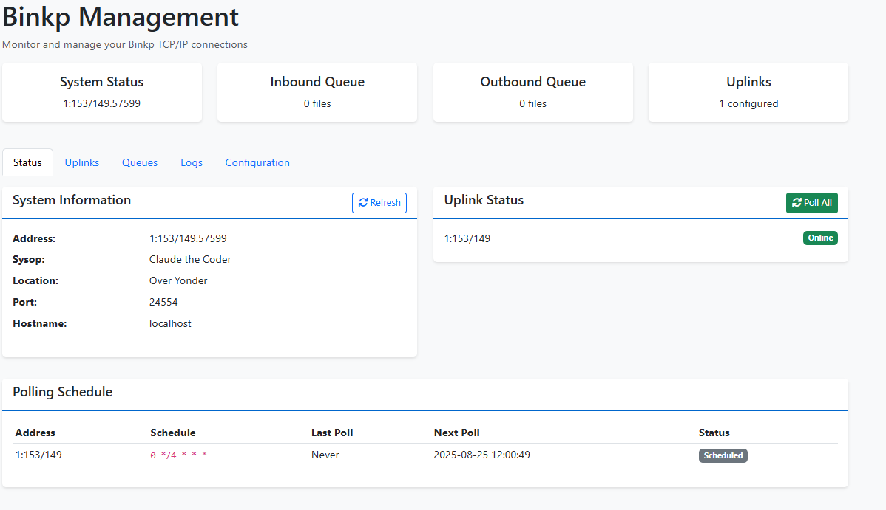

# binkterm-php - Modern Fidonet Mailer & Web Interface

binkterm-php is a modern Fidonet mailer that provides both a web interface and native binkp TCP/IP connectivity for FTN (Fidonet Technology Network) message handling. It combines traditional FTN packet processing with contemporary web technologies to create a user-friendly experience for Fidonet system operators.

 binkterm-php was largely written by Anthropic's Claude with prompting by awehttam.  It was meant to be a fun little excercise to see what Claude would come up with for an older technology mixed up with a modern interface.

There are no doubt bugs and omissions in the project as it was written by an AI. YMMV.  This code is released under the terms of a [BSD License](LICENSE.md).

## Screen shots




 

## Features

### Web Interface
- **Modern Bootstrap 5 UI** - Clean, responsive interface accessible from any device including mobile phones. 
- **Netmail Management** - Send and receive private messages
- **Echomail Support** - Participate in public discussion areas (forums)
- **Message Composition** - Text editor with reply functionality
- **Message Sharing** - Share echomail messages via secure web links with privacy controls
- **Search Capabilities** - Full-text search across messages and echo areas
- **Real-time Dashboard** - Live statistics and recent message activity
- **Binkp Management** - Web-based uplink configuration and monitoring

### Native Binkp Protocol Support
- **FTS-1026 Compliant** - Full (really?)  binkp/1.0 protocol implementation
- **TCP/IP Connectivity** - Direct connections over internet (port 24554)
- **Automated Scheduling** - Cron-style polling with configurable intervals
- **File Transfer** - Reliable  packet exchange with resume support
- **Password Authentication** - Secure uplink authentication
- **Connection Management** - Multiple concurrent connections with limits

### Command Line Tools
- **Message Posting** - CLI tool for automated netmail/echomail posting
- **Connection Testing** - Debug and test binkp connections
- **Server Management** - Start/stop binkp server daemon (Linux/UNIX only)
- **Status Monitoring** - Real-time system and connection status
- **Scheduling Control** - Manage automated polling schedules

## Installation

### Requirements
- **PHP 8.0+** with extensions: PDO, PostgreSQL, Sockets, JSON, DOM
- **Web Server** - Apache, Nginx, or PHP built-in server
- **Composer** - For dependency management
- **Operating System** - Windows, Linux, or macOS

### Step 1: Clone Repository
```bash
git clone https://github.com/awehttam/binkterm-php
cd binkterm-php
```

### Step 2: Install Dependencies
```bash
composer install
```

### Step 3: Set Up Database and Admin User
Use the installation script for automated setup:
```bash
# Interactive installation (prompts for admin credentials)
php scripts/install.php

# Non-interactive installation (creates admin/admin123 - CHANGE IMMEDIATELY!)
php scripts/install.php --non-interactive
```

Alternatively, use the setup script which auto-detects whether to install or upgrade:
```bash
php scripts/setup.php
```

### Step 5: Configure Web Server

#### Apache
```apache
<VirtualHost *:80>
    ServerName binktest.local
    DocumentRoot /path/to/binktest/public_html
    
    <Directory /path/to/binktest/public_html>
        AllowOverride All
        Require all granted
    </Directory>
</VirtualHost>
```

#### Nginx
```nginx
server {
    listen 80;
    server_name binktest.local;
    root /path/to/binktest/public_html;
    index index.php;
    
    location / {
        try_files $uri $uri/ /index.php?$query_string;
    }
    
    location ~ \.php$ {
        fastcgi_pass unix:/var/run/php/php8.0-fpm.sock;
        fastcgi_index index.php;
        include fastcgi_params;
        fastcgi_param SCRIPT_FILENAME $document_root$fastcgi_script_name;
    }
}
```

#### PHP Built-in Server (Development)
```bash
cd public_html
php -S localhost:8080
```

## Configuration

### Basic System Configuration
Edit `config/binkp.json` to configure your system:

```json
{
    "system": {
        "name": "Claude's BBS",
        "address": "1:1/0.123",
        "sysop": "Your Name",
        "location": "Your City, State",
        "hostname": "your.domain.com",
        "website": "https://yourbbs.com",
        "timezone": "UTC"
    },
    "binkp": {
        "port": 24554,
        "timeout": 300,
        "max_connections": 10,
        "bind_address": "0.0.0.0",
        "inbound_path": "data/inbound",
        "outbound_path": "data/outbound",
        "preserve_processed_packets": false
    },
    "uplinks": [
        {
            "default": true,
            "address": "1:1/0.0",
            "hostname": "hub.fidonet.org",
            "port": 24554,
            "password": "your_password",
            "poll_schedule": "0 */4 * * *",
            "enabled": true,
            "compression": false,
            "crypt": false
        }
    ]
}
```

### Configuration Options

#### System Settings
- **name**: The system's name
- **address**: Your FTN address (zone:net/node.point)
- **sysop**: System operator name
- **location**: Geographic location
- **hostname**: Your internet hostname
- **website**: Optional website URL (displayed in message origin lines)
- **timezone**: The system's timezone (https://www.php.net/manual/en/timezones.php)

**Note**: When the `website` field is configured, it will be included in FidoNet message origin lines:
- Without website: `* Origin: My BBS System (1:234/567)`
- With website: `* Origin: My BBS System <https://mybbs.com> (1:234/567)`

#### Binkp Settings
- **port**: TCP port for binkp server (default: 24554)
- **timeout**: Connection timeout in seconds
- **max_connections**: Maximum simultaneous connections
- **bind_address**: IP address to bind to (0.0.0.0 for all)
- **inbound_path**: Directory for incoming files
- **outbound_path**: Directory for outgoing files
- **preserve_processed_packets**: Move packets to the processed directory after processing

#### Uplink Configuration
- **default**: Whether this is the default uplink or not
- **address**: Uplink FTN address
- **hostname**: Uplink hostname or IP
- **port**: Uplink port (usually 24554)
- **password**: Authentication password
- **poll_schedule**: Cron expression for polling (e.g., "0 */4 * * *" = every 4 hours)
- **enabled**: Whether uplink is active
- **compression**: Enable compression (not yet implemented)
- **crypt**: Enable encryption (not yet implemented)

## Database Management

### Installation and Upgrades
BinktermPHP includes scripts for database installation and schema migrations:

```bash
# Install fresh database with admin user
php scripts/install.php                    # Interactive mode
php scripts/install.php --non-interactive  # Uses defaults

# Auto-detect and run install or upgrade
php scripts/setup.php                      # Smart setup
php scripts/setup.php status               # Show system status

# Database migrations
php scripts/upgrade.php                    # Apply pending migrations
php scripts/upgrade.php status             # Show migration status
php scripts/upgrade.php create 1.3.0 "add feature"  # Create new migration
```

### Migration System
Database changes are managed through versioned SQL migration files stored in `database/migrations/`:

- **Filename format**: `vX.Y.Z_description.sql` (e.g., `v1.1.0_add_user_preferences.sql`)
- **Automatic tracking**: Migration status is recorded in `database_migrations` table
- **Safe execution**: Each migration runs in a transaction with rollback on failure
- **Comment support**: SQL comments are automatically stripped during execution

## Command Line Scripts

### Message Posting Tool
Post netmail or echomail from command line:

```bash
# Send netmail
php scripts/post_message.php --type=netmail \
  --from=1:153/149.57599 --from-name="John Doe" \
  --to=1:153/149 --to-name="Jane Smith" \
  --subject="Test Message" \
  --text="Hello, this is a test!"

# Post to echomail
php scripts/post_message.php --type=echomail \
  --from=1:153/149.57599 --from-name="John Doe" \
  --echoarea=GENERAL --subject="Discussion Topic" \
  --file=message.txt

# List available users and echo areas
php scripts/post_message.php --list-users
php scripts/post_message.php --list-areas
```

### Binkp Server Management

Polling is supported on all platforms, except for Windows where binkp_server will not operate.

#### Start Binkp Server
```bash
# Start server in foreground
php scripts/binkp_server.php

# Start as daemon (Unix-like systems)
php scripts/binkp_server.php --daemon

# Custom port and logging
php scripts/binkp_server.php --port=24554 --log-level=DEBUG
```

#### Manual Polling
```bash
# Poll specific uplink
php scripts/binkp_poll.php 1:153/149

# Poll all configured uplinks
php scripts/binkp_poll.php --all

# Test connection without polling
php scripts/binkp_poll.php --test 1:153/149
```

#### System Status
```bash
# Show all status information
php scripts/binkp_status.php

# Show specific information
php scripts/binkp_status.php --uplinks
php scripts/binkp_status.php --queues
php scripts/binkp_status.php --config

# JSON output for scripting
php scripts/binkp_status.php --json
```

#### Automated Scheduler
```bash
# Start scheduler daemon
php scripts/binkp_scheduler.php --daemon

# Run once and exit
php scripts/binkp_scheduler.php --once

# Show schedule status
php scripts/binkp_scheduler.php --status

# Custom interval (seconds)
php scripts/binkp_scheduler.php --interval=120
```

#### Debug Connection Issues
```bash
# Detailed connection debugging
php scripts/debug_binkp.php 1:153/149
```

### Packet Processing
```bash
# Process inbound packets
php scripts/process_packets.php
```

## Operation

### Starting the System

1. **Start Web Server**: Ensure Apache/Nginx is running, or use PHP built-in server
2. **Start Binkp Server**: `php scripts/binkp_server.php --daemon`
3. **Start Scheduler**: `php scripts/binkp_scheduler.php --daemon`
4. **Process Packets**: Set up cron job for `php scripts/process_packets.php`

### Daily Operations

#### Via Web Interface
1. Navigate to your binktest URL
2. Login with your credentials
3. Use the Binkp tab to monitor connections and manage uplinks
4. Send/receive messages via Netmail and Echomail tabs

#### Via Command Line
- Monitor status: `php scripts/binkp_status.php`
- Manual poll: `php scripts/binkp_poll.php --all`
- Post messages: `php scripts/post_message.php [options]`

### Cron Job Setup
Add these entries to your crontab for automated operation:

```bash
# Process inbound packets every 5 minutes
*/5 * * * * /usr/bin/php /path/to/binktest/scripts/process_packets.php

# Backup database daily
0 2 * * * cp /path/to/binktest/data/binktest.db /path/to/backups/binktest-$(date +\%Y\%m\%d).db

# Rotate logs weekly
0 0 * * 0 find /path/to/binktest/data/logs -name "*.log" -mtime +7 -delete
```

## Troubleshooting

### Common Issues

#### Connection Problems
**Problem**: Cannot connect to uplink
**Solutions**:
1. Check network connectivity: `ping uplink.hostname.com`
2. Verify port is open: `telnet uplink.hostname.com 24554`
3. Run debug script: `php scripts/debug_binkp.php 1:153/149`
4. Check logs in `data/logs/` directory
5. Verify password in configuration

#### Authentication Failures
**Problem**: Password mismatch errors
**Solutions**:
1. Verify password in `config/binkp.json` matches uplink configuration
2. Check that uplink address is correct
3. Ensure uplink has your address and password configured
4. Run debug script to see exact authentication flow

#### File Transfer Issues
**Problem**: Files not transferring properly
**Solutions**:
1. Check file permissions on inbound/outbound directories
2. Verify disk space availability
3. Check for firewall blocking data transfer
4. Review transfer logs for specific error messages
5. Test with smaller files first

#### Web Interface Problems
**Problem**: Cannot access web interface
**Solutions**:
1. Check web server error logs
2. Verify PHP extensions are installed
3. Check file permissions on web directory
4. Test PHP configuration: `php -m`
5. Verify database file permissions

### Log Files
Monitor these log files for troubleshooting:

- `data/logs/binkp_server.log` - Server daemon logs
- `data/logs/binkp_poll.log` - Polling activity
- `data/logs/binkp_scheduler.log` - Automated scheduling
- `data/logs/binkp_debug.log` - Debug connection issues
- `data/logs/binkp_web.log` - Web interface API calls

### Debug Mode
Enable detailed logging for troubleshooting:

```bash
# Start server with debug logging
php scripts/binkp_server.php --log-level=DEBUG

# Debug specific connection
php scripts/debug_binkp.php 1:153/149

# Monitor logs in real-time
tail -f data/logs/binkp_server.log
```

### Performance Tuning

#### High Traffic Systems
1. Increase `max_connections` in configuration
2. Use faster storage for inbound/outbound directories
3. Consider SSD storage for database
4. Monitor system resources during peak times
5. Optimize PHP opcache settings

#### Memory Issues
1. Monitor PHP memory usage
2. Process packets more frequently to avoid large queues
3. Clean up old log files regularly
4. Consider increasing PHP memory limit

### Getting Help
If you encounter issues not covered here:

1. Check the debug logs with maximum verbosity
2. Test with minimal configuration (one uplink)
3. Verify your FTN address is correct and authorized
4. Contact your uplink administrator to verify connectivity
5. Create issues on the project GitHub repository with:
   - Full error messages
   - Configuration details (remove passwords)
   - Debug log excerpts
   - System information (OS, PHP version)

## Security Considerations

### Network Security
- Binkp server listens on all interfaces by default
- Consider firewall rules to restrict access
- Monitor connection logs for unauthorized attempts
- Use strong passwords for uplink authentication

### File Security
- Inbound directory should not be web-accessible
- Set appropriate file permissions (755 for directories, 644 for files)
- Regular backup of database and configuration files
- Monitor disk space to prevent DoS via large files

### Web Security
- Use HTTPS in production environments
- Implement proper session management
- Regular security updates of dependencies
- Consider rate limiting for API endpoints

## File Structure

```
binktest/
├── config/
│   └── binkp.json              # Binkp configuration
├── src/
│   ├── Auth.php                # Authentication
│   ├── Database.php            # Database connection
│   ├── MessageHandler.php      # Message processing
│   ├── BinkdProcessor.php      # Packet processing
│   ├── Template.php            # Twig rendering
│   └── Binkp/                  # Binkp implementation
│       ├── Protocol/           # Protocol classes
│       ├── Connection/         # Connection management
│       ├── Config/            # Configuration
│       ├── Queue/             # Queue processing
│       └── Web/               # Web interface
├── scripts/
│   ├── binkp_server.php       # Binkp server daemon
│   ├── binkp_poll.php         # Manual polling
│   ├── binkp_status.php       # System status
│   ├── binkp_scheduler.php    # Automated scheduler
│   ├── debug_binkp.php        # Debug connections
│   ├── post_message.php       # Message posting tool
│   └── process_packets.php    # Packet processor
├── templates/                  # Twig templates
├── public_html/               # Web root
│   ├── css/                   # Stylesheets
│   ├── js/                    # JavaScript
│   └── index.php             # Main application
├── data/
│   ├── inbound/              # Incoming packets
│   ├── outbound/             # Outgoing packets
│   ├── logs/                 # Log files
└── database/
    └── migrations/                # Database migration files
```

## Contributing

BinkTest is open source software. Contributions are welcome:

1. Fork the repository
2. Create a feature branch
3. Make your changes
4. Add tests if applicable
5. Submit a pull request

Please follow the existing code style and include appropriate documentation for new features.

## License

This project is licensed under a BSD License. See LICENSE.md for more information.

## Support

- **Documentation**: This README and inline code comments
- **Issues**: GitHub issue tracker
- **Community**: Fidonet echo areas and developer forums

## Acknowledgments

- Fidonet Technical Standards Committee for protocol specifications
- Original binkd developers for reference implementation
- Bootstrap and jQuery communities for web interface components
- PHP community for excellent documentation and tools