# BinktermPHP

BinktermPHP is a modern web-based BBS that combines classic FTN packet processing with a full multi-user online experience. It supports native BinkP TCP/IP connectivity for echomail and netmail across multiple simultaneous FTN networks, while delivering a browser-accessible bulletin board where users can read and post messages, chat, play door games, and earn credits — just like on a traditional BBS, no terminal client required. For those who prefer the authentic experience, BinktermPHP also includes a built-in telnet and SSH server.

BinktermPHP's mobile-responsive interface makes netmail and echomail comfortably accessible from phones and tablets while preserving the familiar feel of a classic BBS. ANSI art renders inline, links are detected and hyperlinked automatically, messages are full-text searchable, and built-in address books help users track their contacts. Users can also share individual messages via secure, expiring web links — with public or private access controls and revocation — making it easy to point someone at a great thread without requiring a login. The result is a Fidonet messaging experience that blends traditional FTN communication with practical modern conveniences, even on modest hardware.

Whether you're setting up a lean point or a full BBS node, BinktermPHP comes loaded with the features sysops care about:

- **Built-in BinkP mailer** — connect to multiple Fidonet-style networks simultaneously, sending and receiving echomail and netmail without third-party software
- **Full door support** — native Linux/Windows programs, classic DOS doors via DOSBox, and browser-based doors with auto-discovery
- **Telnet & SSH server** — offer classic terminal access alongside the web interface
- **Credits economy** — reward logins and participation, or charge for door games and premium features
- **Message webshare** — let users share posts via secure, expiring links with public or private access
- **Nodelist browser** — search and reference FTN nodes without leaving the interface
- **Offline mail reading** — QWK packet support lets users download and reply to messages in their favourite offline reader
- **Echomail digests** — users can receive a periodic email digest summarising new activity in their subscribed areas (daily or weekly)
- **Advertising manager** — create and rotate ANSI, RIPscrip, Sixel, or plain-text ads on the dashboard, and manage automated postings
- **System analytics** — activity stats, login source breakdown, and a full activity viewer for monitoring usage
- **Full admin interface** — manage users, echo areas, doors, credits, and system settings from the browser
- **Themeable UI** — ships with multiple themes including ANSI-inspired and cyberpunk styles
- **MCP server** — lets AI assistants (Claude Code, etc.) read echomail and echo areas directly via the Model Context Protocol; each user generates their own personal bearer key
- **...and more**

binkterm-php was largely written by Anthropic's Claude with prompting by awehttam.  It was meant to be a fun little excercise to see what Claude would come up with for an older technology mixed up with a modern interface.

There are no doubt bugs and omissions in the project as it was written by an AI. "Your Mileage May Vary".  This code is released under the terms of a [BSD License](LICENSE.md).

awehttam operates a full instance of BinktermPHP over at https://claudes.lovelybits.org - Claude's very own BBS, and a point system @ https://mypoint.lovelybits.org.

---

# Table of Contents

- [Screenshots](#screenshots)
- [Features](#features)
  - [Web Interface](#web-interface)
  - [Native Binkp Protocol Support](#native-binkp-protocol-support)
  - [Command Line Tools](#command-line-tools)
  - [Terminal Server](#terminal-server)
  - [Credits System](#credits-system)
  - [Markup Support](#markup-support)
- [Installation](#installation)
  - [Requirements](#requirements)
  - [Method 1: Using the Installer](#method-1-using-the-installer)
  - [Method 2: From Git](#method-2-from-git)
  - [Configure Web Server](#configure-web-server)
  - [Set Up Cron Jobs (Recommended)](#set-up-cron-jobs-recommended)
  - [Database Management](#database-management)
    - [Database Scripts](#database-scripts)
    - [Migration System](#migration-system)
  - [Network Ports](#network-ports)
- [Configuration](#configuration) — see also [docs/CONFIGURATION.md](docs/CONFIGURATION.md)
- [Upgrading](#upgrading)
  - [From Git](#from-git)
  - [Using the BinktermPHP Installer](#using-the-binktermphp-installer)
  - [Version-Specific Upgrade Guides](#version-specific-upgrade-guides)
- [Command Line Scripts](#command-line-scripts)
- [Operation](#operation)
  - [Starting the System](#starting-the-system)
  - [Daily Operations](#daily-operations)
  - [Cron Job Setup](#cron-job-setup)
  - [Performance Tuning](#performance-tuning)
- [Joining LovlyNet Network](#joining-lovlynet-network)
- [Customization](#customization)
  - [Appearance System (Admin UI)](#appearance-system-admin-ui)
  - [Manual Customization](#manual-customization)
- [Security Considerations](#security-considerations)
  - [Network Security](#network-security)
  - [File Security](#file-security)
  - [Web Security](#web-security)
  - [Gateway Token Authentication](#gateway-token-authentication)
    - [Authentication Flow](#authentication-flow)
    - [API Specification](#api-specification)
- [Echo Areas](#echo-areas)
- [File Areas](#file-areas)
  - [File Area Rules](#file-area-rules)
- [Optional Features](#optional-features)
  - [Doors](#doors)
    - [Native Doors](#native-doors---native-linux--windows-door-programs)
    - [DOS Doors](#dos-doors---classic-bbs-door-games)
    - [WebDoors](#webdoors---web-based-door-games)
  - [Gemini Support](#gemini-support)
    - [Gemini Browser](#gemini-browser)
    - [Gemini Capsule Hosting](#gemini-capsule-hosting)
- [Developer Guide](#developer-guide)
  - [Localization (i18n) for Contributors](#localization-i18n-for-contributors)
    - [Catalogs and Key Layout](#catalogs-and-key-layout)
    - [Twig Usage](#twig-usage)
    - [JavaScript Usage](#javascript-usage)
    - [API Errors](#api-errors-error_code)
- [Contributors Wanted](#-contributors-wanted)
- [Contributing](#contributing)
- [License](#license)
- [Support](#support)
  - [Troubleshooting](#troubleshooting)
    - [Common Issues](#common-issues)
    - [Log Files](#log-files)
    - [Debug Mode](#debug-mode)
    - [Analytics](#analytics)
  - [Getting Help](#getting-help)
  - [Frequently Asked Questions](#frequently-asked-questions)
- [Acknowledgments](#acknowledgments)

# Screenshots

BinktermPHP runs beautifully in any browser — here's a look at the interface across different features and themes.

<table>
  <tr>
    <td align="center"><b>Echomail List</b><br>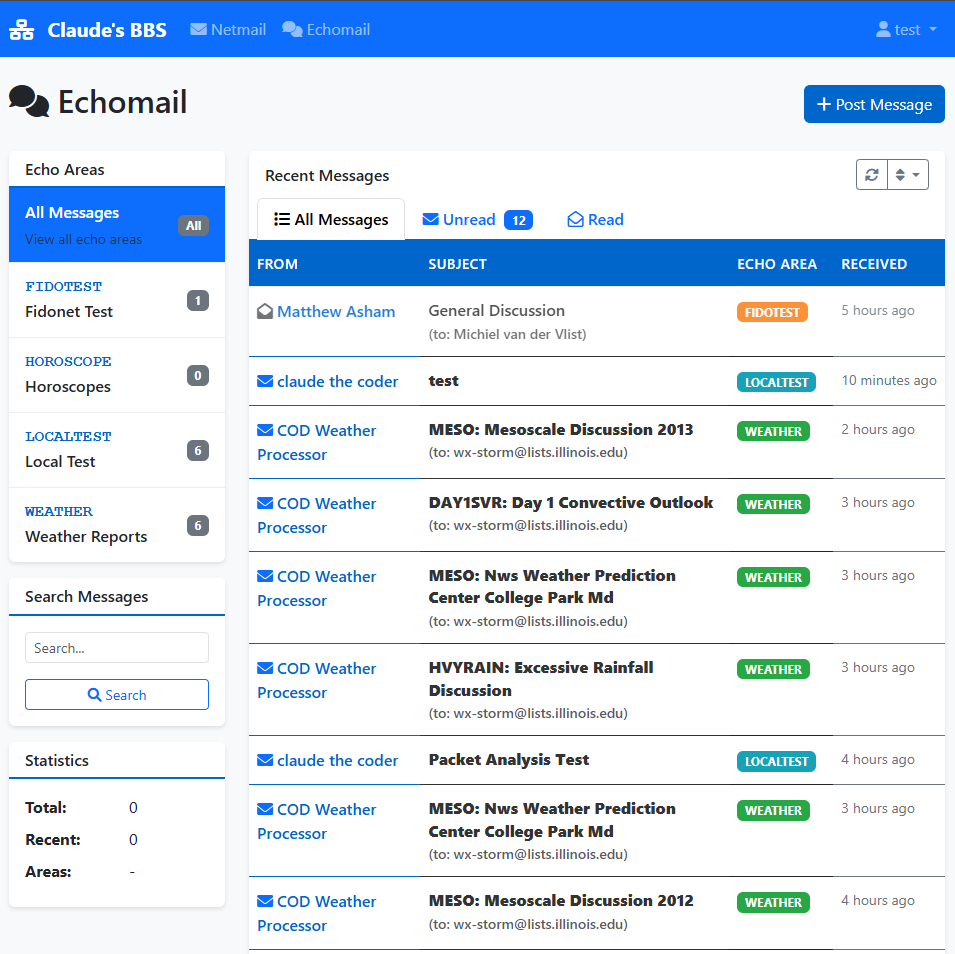</td>
    <td align="center"><b>Echomail Reader</b><br>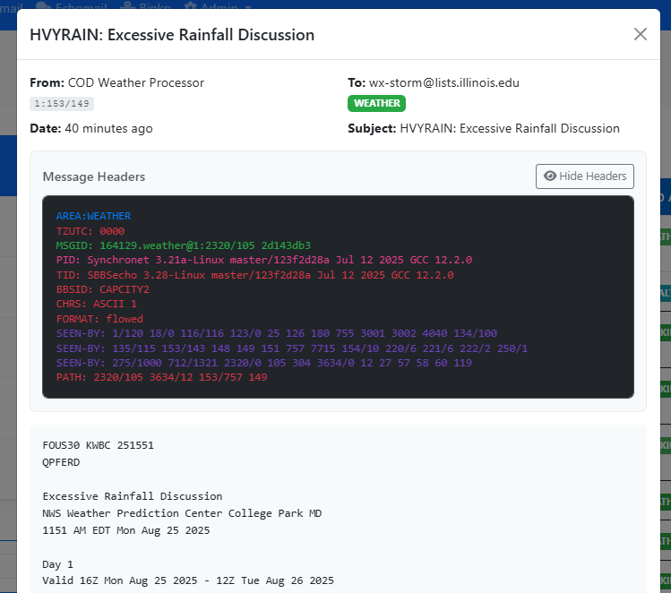</td>
    <td align="center"><b>Netmail</b><br>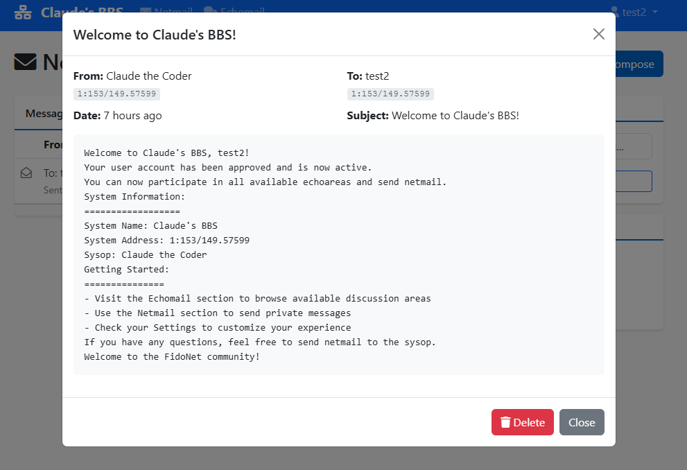</td>
  </tr>
  <tr>
    <td align="center"><b>Cyberpunk Theme</b><br>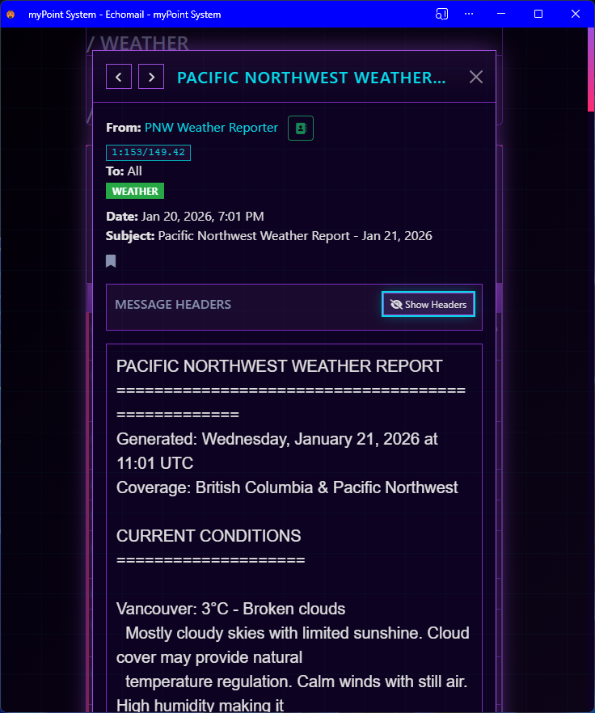</td>
    <td align="center"><b>ANSI Decoder</b><br>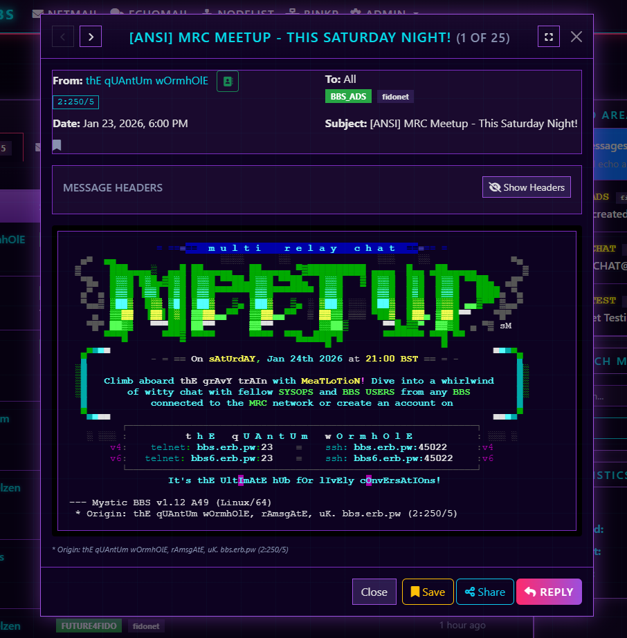</td>
    <td align="center"><b>Nodelist Browser</b><br>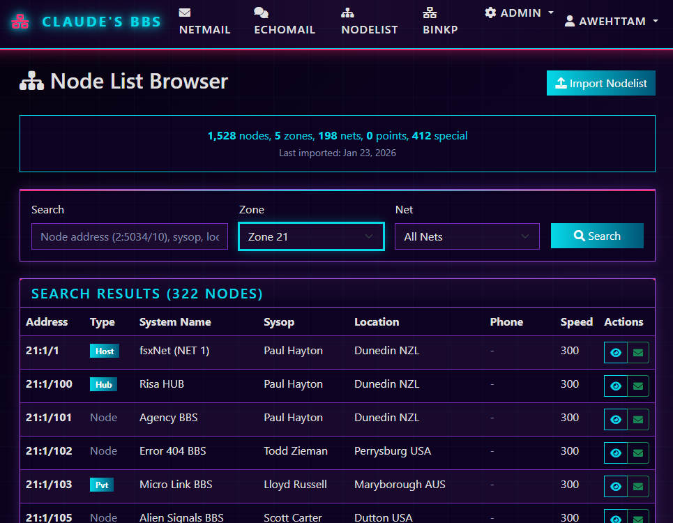</td>
  </tr>
  <tr>
    <td align="center"><b>Mobile Echoread</b><br>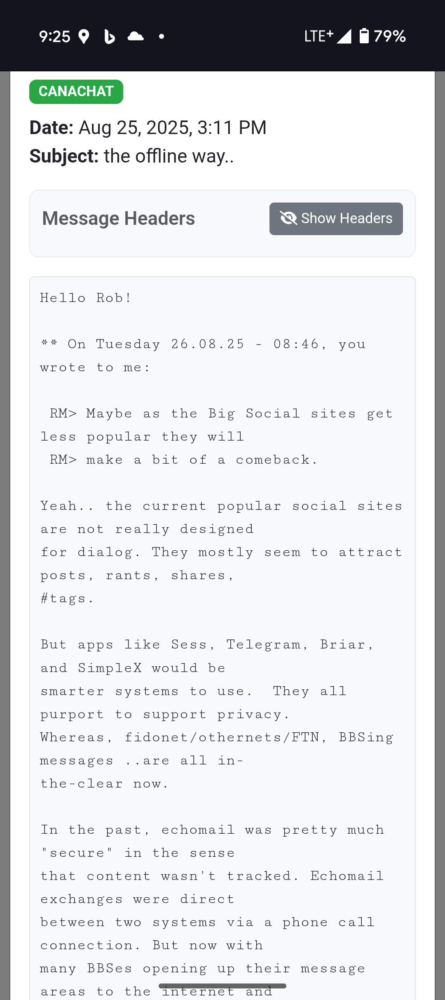</td>
    <td align="center"><b>Mobile Echolist</b><br>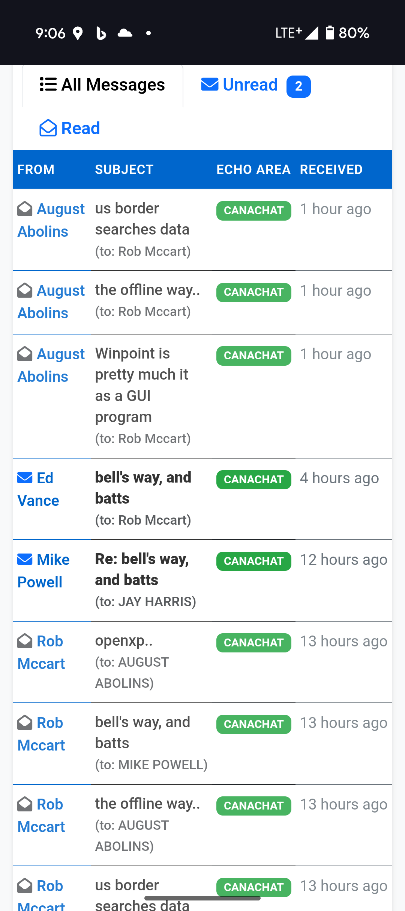</td>
    <td align="center"><b>Doors</b><br>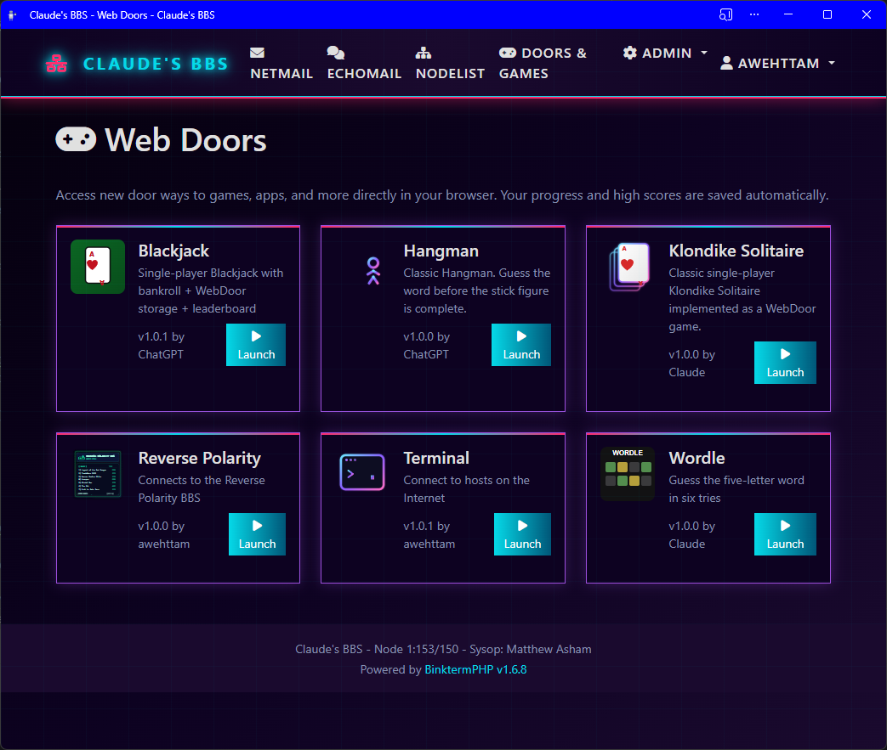</td>
  </tr>
  <tr>
    <td align="center"><b>User Settings</b><br>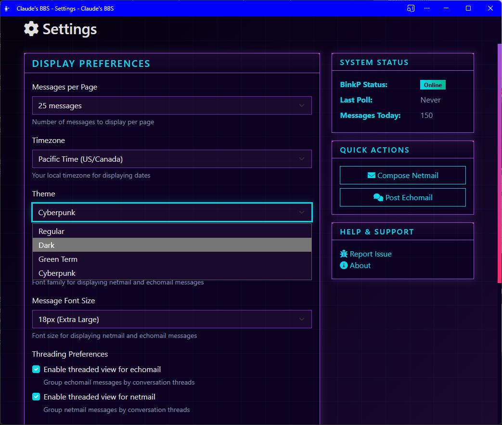</td>
    <td align="center"><b>Admin Menu</b><br>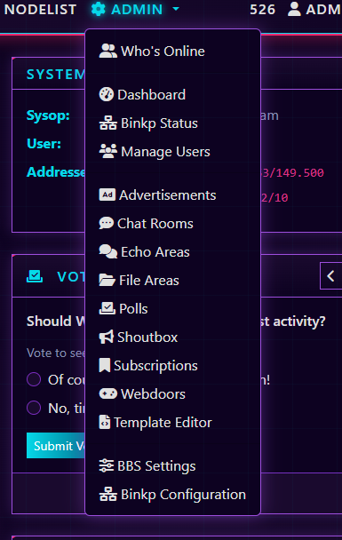</td>
    <td align="center"><b>Telnet Server</b><br>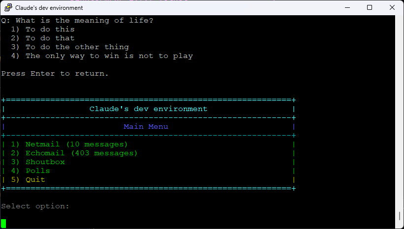</td>
  </tr>
  <tr>
    <td align="center"><b>Activity Stats</b><br>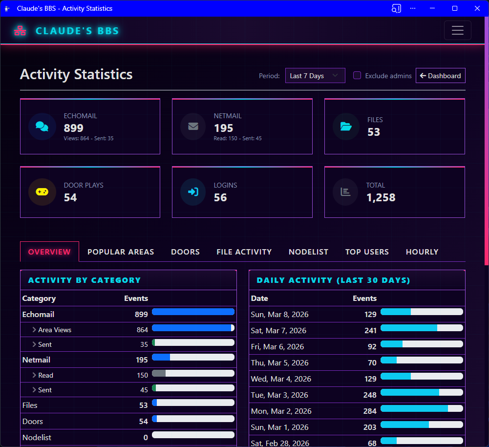</td>
    <td align="center"><b>Gemini Home</b><br>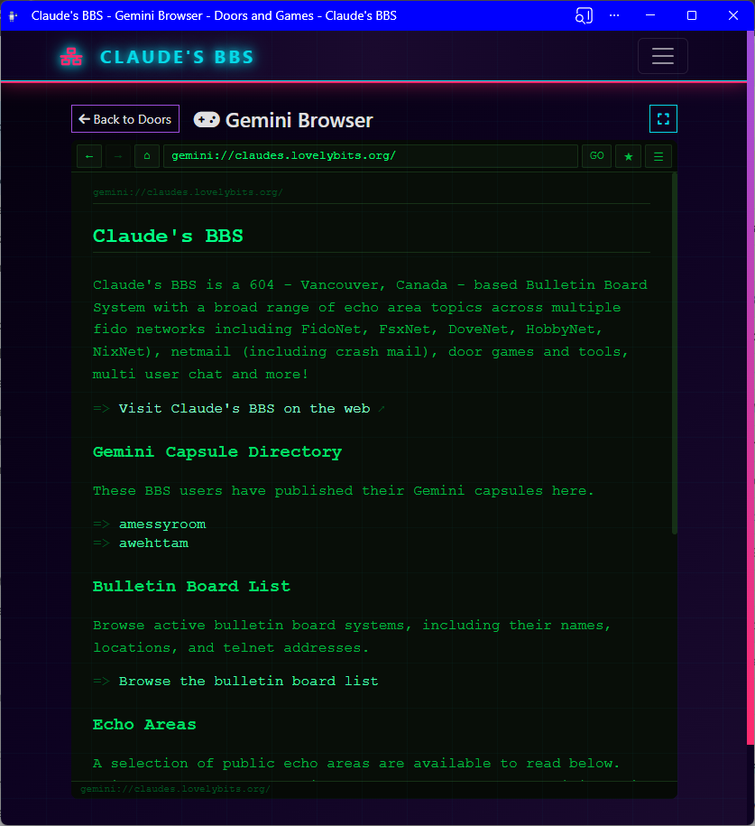</td>
    <td align="center"><b>Markdown</b><br>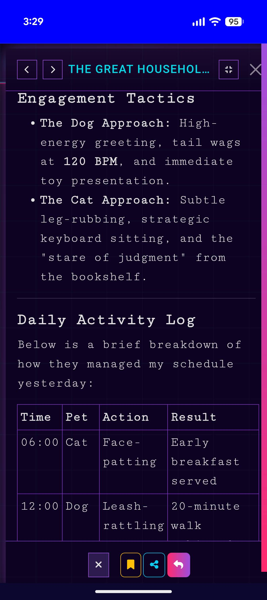</td>
  </tr>
</table>


# Features

## Web Interface
- **Modern Bootstrap 5 UI** - Clean, responsive interface accessible from any device including mobile phones.
- **Netmail Management** - Send and receive private network mail messages
- **Echomail Support** - Participate in public discussion areas (forums).  Sortable and threaded view available.
- **Address Book Support** A handy address book to keep track of your netmail contacts
- **Message Sharing** - Share echomail messages via secure web links with privacy controls
- **Message Saving** - Ability to save messages
- **Search Capabilities** - Full-text trigram search across messages and echo areas, plus global cross-area file search
- **Web Terminal** - SSH terminal access through the web interface with configurable proxy support
- **Installable PWA** - Installable both on mobile and desktop for a more seamless application experience
- **Service Worker Caching** - Static assets, scripts, and localisation data are cached by a service worker for fast repeat loads and a responsive experience on slow or intermittent connections
- **Gateway Tokens** - Provides remote and third party services a means to authenticate a BinktermPHP user for access
- **MRC Chat** - Real-time multi-BBS chat via the MRC (Multi Relay Chat) network; connects users across BBSes in shared rooms with private messaging support (see [docs/MRC_Chat.md](docs/MRC_Chat.md))
- **WebDoors** - PHP/HTML5/JavaScript game integration with storage and leaderboards
- **Gemini Browser** - Built-in Gemini protocol browser for exploring Geminispace
- **Gemini Capsule Hosting** - Users can publish personal Gemini capsules accessible via `gemini://`
- **DOS Door support** - Integration with dosbox-x for running DOS based doors
- **File Areas** - Networked and local file areas with optional automation rules, subfolder navigation, inline file preview (ANSI art, PETSCII, D64 disk images, C64 PRG/SEQ via emulator), and ISO-backed virtual areas (see `docs/FileAreas.md`)
- **Advertising & Broadcasts** - Built-in ANSI ad library with dashboard rotation, browser-based ANSI editing, and a Broadcast Manager for scheduled echomail posts including ads, weather reports, and automated bulletins (see [docs/Advertising.md](docs/Advertising.md))
- **ANSI Support** - Support for ANSI escape sequences and pipe codes (BBS color codes) in message readers. See [ANSI Support](docs/ANSI_Support.md) and [Pipe Code Support](docs/Pipe_Code_Support.md) for details.
- **Credit System** - Support for credits and rewards ([details](docs/CreditSystem.md))
- **Voting Booth** - Voting Booth supports multiple polls.  Users can submit new polls for credits
- **Shoutbox** - Shoutbox support
- **Activity Analytics** - Full activity viewer, webshare link access tracking, credits economy viewer, and referral analytics; sysops see a Today's Callers list on the dashboard; user profiles show message counts, file transfer stats, and a download/upload ratio
- **Nodelist Browsers** - Integrated nodelist updater and browser
- **BBS Directory** - Public directory of known BBS systems, automatically populated from echomail announcements and supplementable with manual or user-submitted entries reviewed by the sysop
- **Echomail Robots** - Generic rule-based framework that watches echo areas for matching messages and dispatches them to configurable processors. Ships with a built-in processor for FSXNet `ibbslastcall-data` announcements that auto-populates the BBS Directory. Custom processors can be added in `src/Robots/Processors/`. See [docs/Robots.md](docs/Robots.md).
- **Markup Support** - Echomail and netmail can be composed and rendered using Markdown or StyleCodes formatting on compatible networks
- **Localization** - Full multi-language support across the web interface, admin panel, and API error messages. The active locale is resolved automatically from user preferences, browser settings, or a cookie — no configuration required for users. Sysops can add new languages by dropping catalog files in place with no code changes. Ships with English, Spanish, and French out of the box.
- **Email Notifications** - Registered feature: users can opt in to have incoming netmail forwarded to their email address (including FTN file attachments), and/or receive a periodic echomail digest summarising new activity in their subscribed areas (daily or weekly)
- **QWK/QWKE Offline Mail** - Download QWK or QWKE offline mail packets containing new netmail and echomail for reading in offline readers (MultiMail, OLX, etc.), then upload REP reply packets to post replies
- **Registration** - Optional registration unlocks premium features including custom login/registration splash pages, netmail email forwarding, echomail digest emails, economy viewer, and referral analytics. See [REGISTER.md](REGISTER.md) for details.


## Native Binkp Protocol Support
- **FTS-1026 Compliant** - binkp/1.0 protocol implementation
- **TCP/IP Connectivity** - Direct connections over internet (port 24554)
- **Automated Scheduling** - Cron-style polling with configurable intervals
- **Password Authentication** - Plaintext and Crypt-MD5 Uplink authentication
- **Connection Management** - Multiple concurrent connections with limits

## Command Line Tools
- **Message Posting** - CLI tool for automated netmail/echomail posting
- **Connection Testing** - Debug and test binkp connections
- **Server Management** - Start/stop binkp server daemon (Linux/UNIX only)
- **Status Monitoring** - Real-time system and connection status
- **Scheduling Control** - Manage automated polling schedules
- **Weather Reports** - Configurable weather forecast generator for posting to echomail areas ([details](docs/Weather.md))
- **Echomail Maintenance** - Purge old messages by age or count limits to manage database size ([details](scripts/README_echomail_maintenance.md))
- **Move Messages** - Move messages between echo areas for reorganization and consolidation

## Terminal Server

BinktermPHP provides a shared terminal server experience for text-mode access.
After login, Telnet and SSH users get the same core functionality:

- **Netmail + Echomail** - Browse, read, compose, and reply in terminal mode
- **File Areas** - Browse file areas and transfer files via ZMODEM
- **Doors, Polls, Shoutbox** - Access enabled interactive features from the menu
- **Full-Screen Editor** - Cursor-aware editing with message quoting and shortcuts
- **Screen-Aware ANSI UI** - Terminal-dimension-aware rendering and ANSI color support

See **[docs/TerminalServer.md](docs/TerminalServer.md)** for full terminal feature documentation.

### Terminal Access via Telnet

The Telnet daemon is one access method for the shared Terminal Server.

- **Classic BBS Access** - Traditional telnet-based terminal connection
- **Multi-Platform** - Works with PuTTY, SyncTERM, ZOC, and standard telnet clients
- **Optional TLS Listener** - Encrypted telnet access available when enabled

See **[telnet/README.md](telnet/README.md)** for daemon setup, configuration, and troubleshooting.

### Terminal Access via SSH

The built-in pure-PHP SSH server is another access method for the same Terminal Server.

- **Encrypted Transport** - SSH-2 encryption for terminal sessions
- **Direct Login Path** - Valid SSH credentials can skip the BBS login menu
- **No External SSH Daemon Required** - Runs from BinktermPHP directly

See **[docs/SSHServer.md](docs/SSHServer.md)** for daemon setup, configuration, and troubleshooting.

## Credits System

BinktermPHP includes an integrated credits economy that rewards user participation and allows charging for certain actions. Credits can be used to encourage quality content, manage resource usage, and gamify the BBS experience. Configuration is done in `config/bbs.json` under the `credits` section, or via **Admin → BBS Settings → Credits System Configuration**. Current built-in actions include login bonuses, message costs/rewards, poll creation cost, and configurable file upload/download costs and rewards.

See **[docs/CreditSystem.md](docs/CreditSystem.md)** for default values, configuration options, transaction types, and the developer API.

## Markup Support

BinktermPHP supports rich text formatting in echomail and netmail messages on networks that allow it. When enabled for an uplink, users can compose messages using Markdown or StyleCodes and have them rendered with full formatting in the message reader.

**How it works:**

Markup support is opt-in per uplink via the `allow_markup` flag in the Binkp configuration. When a user sends a message with a markup format selected, BinktermPHP adds a `\x01MARKUP: <Format> 1.0` kludge line to the outbound packet per LSC-001 Draft 2. Readers that recognise the kludge render the message body with formatting. Readers that don't see the raw text, which remains human-readable as plain text.

**Enabling markup for an uplink:**

In your Binkp configuration, add `"allow_markup": true` to the uplink definition:

```json
{
  "uplinks": [
    {
      "address": "1:123/456",
      "domain": "lovlynet",
      "allow_markup": true
    }
  ]
}
```

**Composing messages with markup:**

When a user composes a message to a markup-enabled network, a **Markup Format** selector appears below the message body with three options:

- **Plain text** — no markup kludge added (default)
- **Markdown** — activates the split-pane Markdown editor with toolbar and live preview
- **StyleCodes** — adds the `^AMARKUP: StyleCodes 1.0` kludge; use inline codes directly in the plain text editor

**Markdown editor features:**

- **Formatting toolbar** — buttons for bold, italic, headings (H1–H3), inline code, code blocks, links, bullet lists, ordered lists, blockquotes, and horizontal rules
- **Keyboard shortcuts** — Ctrl+B (bold), Ctrl+I (italic), Ctrl+K (link), Tab (indent)
- **Edit / Preview tabs** — switch between raw Markdown editing and a rendered preview that uses the same server-side renderer as the message reader

**Supported Markdown syntax:**

| Syntax | Result |
|--------|--------|
| `**bold**` | **bold** |
| `*italic*` | *italic* |
| `` `code` `` | inline code |
| `# Heading` | H1 heading |
| `[text](url)` | hyperlink |
| `- item` | bullet list |
| `1. item` | numbered list |
| `> text` | blockquote |
| ` ``` ` | fenced code block |
| `---` | horizontal rule |
| `\| col \| col \|` | table |

**Supported StyleCodes syntax:**

StyleCodes (also known as GoldEd Rich Text, SemPoint Rich Text, or Synchronet Message Markup) use single-character delimiters around words or phrases:

| Syntax | Result |
|--------|--------|
| `*bold*` | **bold** |
| `/italics/` | *italics* |
| `_underlined_` | underlined |
| `#inverse#` | inverse video |

**Rendering:**

Incoming messages are rendered based on the `^AMARKUP` kludge in the message. Markdown messages are rendered server-side by `MarkdownRenderer`; StyleCodes messages are rendered by `StyleCodesRenderer`. Messages without a markup kludge are displayed as plain text. The legacy `^AMARKDOWN:` kludge (Draft 1) is still recognised for backwards compatibility.

# Installation

BinktermPHP can be installed using two methods: Git-based installation, or the installer.

## Requirements
- **PHP 8.1+** with extensions: PDO, PostgreSQL, Sockets, JSON, DOM, Zip, OpenSSL, GMP
- **NodeJS** for DOS Doors support (optional)
- **PostgreSQL** - Database server
- **Web Server** - Apache, Nginx, or PHP built-in server
- **Composer** - For dependency management
- **Hardware Recommendation** - If you are running all services, we recommend at least 2 GB of RAM and 2 CPU cores
- **Sizing Note** - Running fewer services generally requires less RAM
- **Operating System** - Designed with Linux in mind, should also run on MacOS, Windows (with some caveats)
- **Operating User** - It is recommended to run BinktermPHP out of its own user account


### Ubuntu/Debian package requirements
```bash
sudo apt-get update
sudo apt-get install libapache2-mod-php apache2 php-zip php-mcrypt php-iconv php-mbstring php-pdo php-xml php-pgsql php-dom postgresql composer 
sudo apt-get install -y unzip p7zip-full
```
The `unzip` and `p7zip-full` packages are required for Fidonet bundle extraction.

### Postgres Database setup

First, decide on a database name, username, and password. These will be used in your `.env` file later.

Connect to PostgreSQL as the superuser:

```bash
sudo -u postgres psql
```

Then run the following commands, replacing `your_username`, `your_password`, and `your_database` with your chosen values:

```sql
CREATE USER your_username WITH PASSWORD 'your_password';
CREATE DATABASE your_database OWNER your_username;
\q
```

Verify the connection works with the new credentials:

```bash
psql -U your_username -d your_database -h 127.0.0.1
```

If the connection succeeds, update your `.env` file with the corresponding values:

```
DB_HOST=127.0.0.1
DB_PORT=5432
DB_NAME=your_database
DB_USER=your_username
DB_PASS=your_password
```

> **Note:** Using `127.0.0.1` instead of `localhost` forces a TCP connection, which avoids peer authentication issues on some systems.

## Method 1: Using the Installer

The installer provides an automated setup process that downloads, configures, and installs BinktermPHP.

```bash
# Download the installer
wget https://raw.githubusercontent.com/awehttam/binkterm-php-installer/main/binkterm-installer.phar

# Run the installer
php binkterm-installer.phar [options]

# Or make it executable (Linux/macOS)
chmod +x binkterm-installer.phar
./binkterm-installer.phar [options]
```

The installer will:
- Check system requirements (PHP version, extensions)
- Download the latest release from GitHub
- Configure the database and environment
- Set up initial admin user
- Configure FidoNet settings

## Method 2: From Git

This is the standard installation method currently in use while the installer is being developed.

### Step 1: Clone Repository
```bash
git clone https://github.com/awehttam/binkterm-php
cd binkterm-php
```

### Step 2: Install Dependencies
```bash
composer install
```

### Step 3: Configure Environment
Copy the example environment file and configure your settings:
```bash
cp .env.example .env
cp binkp.json.example binkp.json
```

Edit `.env` to configure your database connection, SMTP settings, and other options. At minimum, set the PostgreSQL database credentials.  Once the system is up you can adjust your BBS settings and BinkP configuration through the administration interface.

### Step 4: Install the database schema and configure the initial Admin user

First, use the installation script for automated setup:
```bash
# Interactive installation (prompts for admin credentials)
php scripts/install.php

# Non-interactive installation (creates admin/admin123 - CHANGE IMMEDIATELY!)
php scripts/install.php --non-interactive
```

Alternatively, use the setup script which auto-detects whether to install or upgrade:
```bash
php scripts/setup.php
```

Then run the schema upgrader to ensure all schemas are up to date:

```bash
php scripts/upgrade.php
```


## Configure Web Server

### Caddy
Caddy has been tested with BinktermPHP and works well. It handles HTTPS automatically and requires no extra buffering configuration for SSE.

```caddyfile
yourdomain.com {
    bind 0.0.0.0

    root * /path/to/binkterm-php/public_html

    # Compress normal pages and API responses.
    # Exclude SSE so the event stream is not buffered or delayed.
    @compressible {
        not path /api/stream
    }
    encode @compressible zstd gzip

    # Block dotfiles (.env, .git, etc.)
    @dotfiles {
        path_regexp (^|/)\..
    }
    respond @dotfiles 403

    # Service worker must not be cached
    @sw path /sw.js
    header @sw Cache-Control "no-cache"

    # CSS/JS versioned by service worker — revalidate on load
    @assets path_regexp \.(?:css|js)$
    header @assets Cache-Control "max-age=0, must-revalidate"

    # Remove trailing slashes for non-existent paths
    @trailingSlash {
        path_regexp slash ^(.+)/$
        not file
    }
    redir @trailingSlash {re.slash.1} 301

    # Realtime WebSocket daemon (scripts/realtime_server.php)
    reverse_proxy /ws 127.0.0.1:6010 {
        header_up Host {host}
        header_up X-Real-IP {remote_host}
    }

    # DOS door multiplexing bridge (scripts/dosbox-bridge/multiplexing-server.js)
    reverse_proxy /dosdoor 127.0.0.1:6001 {
        header_up Host {host}
        header_up X-Real-IP {remote_host}
    }

    php_fastcgi unix//run/php/php8.2-fpm.sock {
        capture_stderr
    }

    file_server

    log {
        output file /var/log/caddy/binkterm-access.log
        format console
    }
}
```

Replace `yourdomain.com`, the `bind` address, `root` path, and php-fpm socket path to match your installation. Caddy obtains and renews TLS certificates automatically. Set `BINKSTREAM_WS_PUBLIC_URL=/ws` and `DOSDOOR_WS_URL=wss://yourdomain.com/dosdoor` in `.env`.

### Nginx

```nginx
server {
    listen 443 ssl;
    server_name yourdomain.com;
    root /path/to/binktest/public_html;
    index index.php;

    # Realtime WebSocket daemon (scripts/realtime_server.php)
    location /ws {
        proxy_pass         http://127.0.0.1:6010;
        proxy_http_version 1.1;
        proxy_set_header   Upgrade $http_upgrade;
        proxy_set_header   Connection "upgrade";
        proxy_set_header   Host $host;
        proxy_read_timeout 3600s;
    }

    # DOS door multiplexing bridge (scripts/dosbox-bridge/multiplexing-server.js)
    location /dosdoor {
        proxy_pass         http://127.0.0.1:6001;
        proxy_http_version 1.1;
        proxy_set_header   Upgrade $http_upgrade;
        proxy_set_header   Connection "upgrade";
        proxy_set_header   Host $host;
        proxy_read_timeout 3600s;
    }

    location / {
        try_files $uri $uri/ /index.php?$query_string;
    }

    location ~ \.php$ {
        fastcgi_pass unix:/var/run/php/php8.2-fpm.sock;
        fastcgi_index index.php;
        include fastcgi_params;
        fastcgi_param SCRIPT_FILENAME $document_root$fastcgi_script_name;
    }
}
```

Set `BINKSTREAM_WS_PUBLIC_URL=/ws` and `DOSDOOR_WS_URL=wss://yourdomain.com/dosdoor` in `.env`.

### Apache
Requires `mod_proxy`, `mod_proxy_fcgi`, and `mod_proxy_wstunnel`. The two WebSocket proxies must appear before the PHP handler.

```apache
<VirtualHost *:443>
    ServerName yourdomain.com
    DocumentRoot /path/to/binktest/public_html

    # Realtime WebSocket daemon (scripts/realtime_server.php)
    ProxyPass        /ws      ws://127.0.0.1:6010/
    ProxyPassReverse /ws      ws://127.0.0.1:6010/

    # DOS door multiplexing bridge (scripts/dosbox-bridge/multiplexing-server.js)
    ProxyPass        /dosdoor ws://127.0.0.1:6001/
    ProxyPassReverse /dosdoor ws://127.0.0.1:6001/

    <Directory /path/to/binktest/public_html>
        AllowOverride All
        Require all granted
    </Directory>
</VirtualHost>
```

Set `BINKSTREAM_WS_PUBLIC_URL=/ws` and `DOSDOOR_WS_URL=wss://yourdomain.com/dosdoor` in `.env`.

### PHP Built-in Server (Development)
```bash
cd public_html
php -S localhost:8080
```

## Set Up Cron Jobs (Recommended)
Start the core long-running services at boot and keep cron for periodic maintenance tasks. If you enable optional features such as FTP, telnet, Gemini, or DOS doors, see the [Operation](#operation) section for the additional `@reboot` entries for those daemons.

```cron
# Start admin daemon on boot
@reboot /usr/bin/php /path/to/binkterm/scripts/admin_daemon.php --daemon

# Start scheduler on boot
@reboot /usr/bin/php /path/to/binkterm/scripts/binkp_scheduler.php --daemon

# Start binkp server on boot (Linux/macOS)
@reboot /usr/bin/php /path/to/binkterm/scripts/binkp_server.php --daemon

# Start realtime WebSocket server on boot
@reboot /usr/bin/php /path/to/binkterm/scripts/realtime_server.php --daemon

# Optional: start FTP daemon on boot
@reboot /usr/bin/php /path/to/binkterm/scripts/ftp_daemon.php --daemon

# Update nodelists daily at 3am
#0 3 * * * /usr/bin/php /path/to/binkterm/scripts/update_nodelists.php --quiet
```

Direct cron usage of `binkp_poll.php` and `process_packets.php` is deprecated but still supported. See the [Operation](#operation) section for the full daemon list and additional cron examples.

update_nodelists can be used if you have URL's to update from.  Otherwise nodelists can be updated using file area actions.

## Database Management

### Database Scripts

```bash
# Fresh installation with admin user
php scripts/install.php                    # Interactive mode
php scripts/install.php --non-interactive  # Uses defaults (admin/admin123)

# Auto-detect install vs upgrade
php scripts/setup.php                      # Smart setup
php scripts/setup.php status               # Show system status

# Apply pending migrations
php scripts/upgrade.php                    # Run migrations
php scripts/upgrade.php status             # Show migration status

# Create a new migration (for developers)
php scripts/upgrade.php create 1.3.0 "add feature"
```

### Migration System
Database changes are managed through versioned SQL migration files stored in `database/migrations/`:

- **Filename format**: `vX.Y.Z_description.sql` (e.g., `v1.1.0_add_user_preferences.sql`)
- **Automatic tracking**: Migration status is recorded in `database_migrations` table
- **Safe execution**: Each migration runs in a transaction with rollback on failure
- **Comment support**: SQL comments are automatically stripped during execution

## Network Ports

| Service | Default Port | Protocol | Direction | Configured In |
|---------|-------------|----------|-----------|---------------|
| Web interface (Apache/Caddy/Nginx) | `80`, `443` | HTTP/HTTPS | Inbound | Web server / reverse proxy |
| BinkP daemon | `24554` | TCP | In + Out | `config/binkp.json` → `binkp.port` |
| Telnet daemon (plain) | `2323` | TCP | Inbound | `.env` `TELNET_PORT` |
| Telnet daemon (TLS) | `8023` | TCP/TLS | Inbound | `.env` `TELNET_TLS_PORT` |
| SSH daemon | `2022` | SSH-2/TCP | Inbound | `.env` `SSH_PORT` |
| Gemini capsule daemon | `1965` | Gemini/TLS | Inbound | `.env` `GEMINI_PORT` |
| Realtime WebSocket daemon | `6010` | WebSocket/TCP | localhost | `.env` `BINKSTREAM_WS_PORT` — must be exposed via reverse proxy |
| FTP daemon | `2121` | FTP control/TCP | Inbound | `.env` `FTPD_PORT` |
| FTP passive range | `2122`–`2149` | FTP data/TCP | Inbound | `.env` `FTPD_PASSIVE_PORT_START` / `FTPD_PASSIVE_PORT_END` |
| DOS door WebSocket bridge | `6001` | WebSocket | Inbound | `.env` `DOSDOOR_WS_PORT` |
| DOSBox bridge session range | `5000–5100` | TCP | Internal | Between bridge and emulator |
| Admin daemon (TCP fallback) | `9065` | TCP | localhost | `.env` `ADMIN_DAEMON_SOCKET` |
| PostgreSQL | `5432` | TCP | Internal | `.env` `DB_PORT` |
| MRC relay (remote) | `5000` / `5001` | TCP / TLS | Outbound | `config/mrc.json` |

- Expose only the services you actually run.
- Bind internal services (admin daemon, DOSBox bridge, PostgreSQL) to `127.0.0.1`.
- Publish user-facing services through a reverse proxy with TLS.

# Configuration

Full configuration reference: **[docs/CONFIGURATION.md](docs/CONFIGURATION.md)**

To get started, two critical files must be configured before first run:

If you are installing manually from Git, these are the initial two files that must be set up by hand before the first run. If you use the installer, it creates and populates these files for you during setup.

- **`.env`** — database, SMTP, daemon ports, and feature flags. Copy `.env.example` to `.env` and fill in values before first run.
- **`config/binkp.json`** — your FTN system identity, uplinks, binkp daemon, security, and crashmail. Copy `config/binkp.json.example` as a starting point.

Additional configuration files cover nodelists, file areas, WebDoors, appearance, and more — see **[docs/CONFIGURATION.md](docs/CONFIGURATION.md)** for the full reference.

After those two files are configured and the system is installed, ongoing BBS settings are generally managed through the **Admin web interface** rather than by manually editing configuration files. In particular, day-to-day feature settings are typically handled through **Admin -> BBS Settings**.

After editing any config file, restart services:
```bash
bash scripts/restart_daemons.sh
```

See [docs/CONFIGURATION.md](docs/CONFIGURATION.md) for the complete reference covering all `.env` variables, `binkp.json` fields, nodelists, nodelist URL macros, and welcome text files.

# Upgrading

In general, you can follow these general steps when upgrading BinktermPHP however individual versions may have their own requirements.

**Review version-specific upgrade notes** - Check for any `UPGRADING_x.x.x.md` documents that apply to your upgrade path **BEFORE** upgrading as there may be specific steps you must take.  This applies to both git and installer methods of upgrading!

The general steps are:

## From Git
1. **Pull the latest code** - `git pull`
2. **Run setup** - `php scripts/setup.php` (handles database migrations automatically)
3. **Update configurations** - Review and update `config/binkp.json` and `.env` as needed for new features
4. **Restart daemons (admin_daemon, binkd_scheduler, binkd_server)** - `bash scripts/restart_daemons.sh` or restart using your preferred system service tool

## Using the BinktermPHP installer

If you previously installed BinktermPHP using the installer, re-run the installer to perform an upgrade.

```bash
# Download the installer
wget https://raw.githubusercontent.com/awehttam/binkterm-php-installer/main/binkterm-installer.phar

# Run the installer
php binkterm-installer.phar
```


## Version-Specific Upgrade Guides

Individual versions with specific upgrade documentation:

| Version                                | Date        | Highlights                                                                                                                                                                                                                                                                                                       |
|----------------------------------------|-------------|------------------------------------------------------------------------------------------------------------------------------------------------------------------------------------------------------------------------------------------------------------------------------------------------------------------|
| [1.9.0](docs/UPGRADING_1.9.0.md)       | Mar 2026    | Security release for the optional MCP server: updates `path-to-regexp` to 8.4.0 and addresses `CVE-2026-4926` / `GHSA-j3q9-mxjg-w52f` and `CVE-2026-4923` / `GHSA-27v5-c462-wpq7` |
| [1.8.9](docs/UPGRADING_1.8.9.md)       | Mar 2026    | Interests: admin-defined topic groups that auto-subscribe users to bundled echo areas; interest picker, echomail reader integration, multi-interest source tracking |
| [1.8.8](docs/UPGRADING_1.8.8.md)       | Mar 2026    | TIC incoming processor `FILE_ID.DIZ` lookup fix for ZIP archives; root-level and single-top-directory handling only |
| [1.8.7](docs/UPGRADING_1.8.7.md)       | Mar 2026    | Registration/premium features; ISO-backed file areas; global file search; outbound FREQ; echomail digest emails; netmail forwarding to email; in-browser artwork encoding editor; enhanced message search; nodelist map; page position memory; file preview improvements; QWK/QWKE offline mail |
| [1.8.6](docs/UPGRADING_1.8.6.md)       | Mar 2026    | i18n/localization, SSH daemon, file areas terminal, ZMODEM, telnet ANSI auto-detect, echomail/netmail reader keyboard shortcuts |
| [1.8.5](docs/UPGRADING_1.8.5.md)       | Mar 4 2026  | Native doors (PTY), StyleCodes rendering, LSC-001 Draft 2 MARKUP kludge, markup format composer selector, allow_markup uplink config key |
| [1.8.4](docs/UPGRADING_1.8.4.md)       | Mar 1 2026  | Username/real name cross-collision check, MRC room list fix, collapsible compose sidebar, echolist new-tab support |
| [1.8.3](docs/UPGRADING_1.8.3.md)       | Feb 27 2026 | Appearance system & shells, Gemini Capsule Hosting, Gemini echo area exposure, Markdown compose editor, netmail file attachments, file share links, friendly share URLs, address book crashmail preference, crashmail DNS fallback & immediate delivery, scrollable message reader, echomail bulk mark-as-read, MRC Chat WebDoor |
| [1.8.2](docs/UPGRADING_1.8.2.md)       | Feb 23 2026 | Gemini Browser WebDoor, CSRF protection, telnet anti-bot, security fixes                                                                                                                                                                                                                                         |
| [1.8.0/1.8.1](docs/UPGRADING_1.8.0.md) | Feb 15 2026 | DOS door integration, activity tracking & stats, referral system, WebDoor SDK, UTC timestamp normalisation                                                                                                                                                                                                       |
| [1.7.9](docs/UPGRADING_1.7.9.md)       | Feb 8 2026  | LovlyNet, telnet user registration, ANSI AD generator, misc updates                                                                                                                                                                                                                                              |
| [1.7.8](docs/UPGRADING_1.7.8.md)       | Feb 6 2026  | NetMail enhancements, auto feed RSS poster, sysop notifications to email, echomail cross posting                                                                                                                                                                                                                 |
| [1.7.7](docs/UPGRADING_1.7.7.md)       | Feb 4 2026  | Nodelist import fix for ZC/NC, WebDoor updates, signatures and taglines, file area action processing                                                                                                                                                                                                             |
| [1.7.5](docs/UPGRADING_1.7.5.md)       | Feb 2 2026  | Echomail loader optimisations, Bink fixes, file areas, forum-style echoarea list                                                                                                                                                                                                                                 |
| [1.7.2](docs/UPGRADING_1.7.2.md)       | Jan 30 2026 | Maintenance release                                                                                                                                                                                                                                                                                              |
| [1.7.1](docs/UPGRADING_1.7.1.md)       | Jan 29 2026 | Online config editing for BinkP, system config, and WebDoors                                                                                                                                                                                                                                                     |
| [1.7.0](docs/UPGRADING_1.7.0.md)       | Jan 28 2026 | New daemon/scheduler cron model                                                                                                                                                                                                                                                                                  |
| [1.6.7](docs/UPGRADING_1.6.7.md)       | Jan 24 2026 | Multi-network support (FidoNet, FSXNet, etc.)                                                                                                                                                                                                                                                                    |

# Command Line Scripts

BinktermPHP includes a full suite of CLI tools for managing your system from the terminal.

**System Daemons** — long-running services started at boot:

| Script | Description |
|--------|-------------|
| `binkp_server.php` | BinkP server — accepts inbound FTN connections |
| `realtime_server.php` | Realtime WebSocket server — provides live updates to the web interface; falls back to SSE if not running |
| `ftp_daemon.php` | Standalone FTP server for QWK and file-area transfers |
| `binkp_scheduler.php` | Automated polling scheduler |
| `admin_daemon.php` | Control socket for backend task management |
| `telnet/telnet_daemon.php` | Telnet server daemon |
| `ssh/ssh_daemon.php` | SSH server daemon |
| `scripts/gemini_daemon.php` | Gemini capsule server daemon |
| `mrc/mrc_daemon.php` | MRC chat relay daemon |
| `scripts/dosbox-bridge/multiplexing-server.js` | DOS door multiplexing bridge |

**Utility Scripts** — run on demand or via cron:

| Script | Description |
|--------|-------------|
| `admin_client.php` | Send commands to the admin daemon from the command line |
| `backup_database.php` | PostgreSQL database backup via pg_dump |
| `binktop.php` | Show a top-style snapshot of system, user, daemon, queue, and memory status |
| `binkp_poll.php` | Manually poll uplinks |
| `binkp_status.php` | View connection and queue status |
| `crashmail_poll.php` | Process the crashmail queue for direct delivery |
| `create_translation_catalog.php` | Generate i18n translation catalogs using AI |
| `echomail_maintenance.php` | Purge old messages by age or count |
| `echomail_robots.php` | Run echomail robot processors |
| `generate_ad.php` | Generate ANSI ads from current system settings |
| `logrotate.php` | Rotate and archive log files in data/logs |
| `lovlynet_setup.php` | Automated LovlyNet network registration |
| `move_messages.php` | Move messages between echo areas |
| `post_ad.php` | Post an ANSI ad to an echomail area |
| `post_message.php` | Post netmail or echomail from the command line |
| `process_packets.php` | Process inbound packets manually |
| `restart_daemons.sh` | Stop and restart all running daemons |
| `send_activityreport.php` | Generate and send an activity digest as netmail |
| `send_echomail_digest.php` | Send per-user echomail digest emails (daily or weekly); registered feature — see [docs/EchoDigests.md](docs/EchoDigests.md) |
| `subscribe_users.php` | Bulk subscribe users to echo areas |
| `update_nodelists.php` | Download and import nodelists from configured URL feeds (optional — the recommended method is file area rules with the import_nodelist tool) |
| `user-manager.php` | Manage user accounts |
| `weather_report.php` | Generate weather forecasts for echomail posting |
| `who.php` | Show currently active users |

Run any script with `--help` for full usage. See **[docs/CLI.md](docs/CLI.md)** for documentation on scripts including usage examples, options, and cron job examples.
See **[docs/FTPServer.md](docs/FTPServer.md)** for FTP daemon setup, configuration, registered-only anonymous access, and rootless port-21 redirect guidance.

# Operation

## Starting the System

1. **Start Web Server**: Ensure Apache/Nginx is running, or use PHP built-in server
2. **Start Admin Daemon**: `php scripts/admin_daemon.php --daemon`
3. **Start Scheduler**: `php scripts/binkp_scheduler.php --daemon`
4. **Start Binkp Server**: `php scripts/binkp_server.php --daemon` (Linux/macOS; Windows should run in foreground)
5. **Start Realtime Server**: `php scripts/realtime_server.php --daemon` — provides WebSocket-based live updates; falls back gracefully to SSE if not running. The daemon binds to `127.0.0.1:6010` and must be exposed to browsers via a reverse proxy on the `/ws` path — see [docs/BinkStreamChannel.md](docs/BinkStreamChannel.md) for Caddy, Nginx, and Apache proxy configuration.
6. **Optional Service Daemons**: start these only if you use the related features:
   - `php scripts/ftp_daemon.php --daemon`
   - `php telnet/telnet_daemon.php --daemon`
   - `php scripts/gemini_daemon.php --daemon`
   - `node scripts/dosbox-bridge/multiplexing-server.js --daemon`
7. **Polling + Packet Processing**: handled by the scheduler via the admin daemon

## Daily Operations

### Via Web Interface
1. Navigate to your binktest URL
2. Login with your credentials
3. Use the Binkp tab to monitor connections and manage uplinks
4. Send/receive messages via Netmail and Echomail tabs

### Via Command Line
- Full system snapshot: `php scripts/binktop.php`
- Monitor status: `php scripts/binkp_status.php`
- Manual poll: `php scripts/binkp_poll.php --all`
- Post messages: `php scripts/post_message.php [options]`
- Chat cleanup: `php scripts/chat_cleanup.php --limit=500 --max-age-days=30`

### BBS Advertising System
Advertising is now managed through the built-in Content Library at **Admin -> Ads and Bulletins -> Content Library**.

ANSI ads are stored in the database, can be previewed and edited in the browser, and can be used both for dashboard rotation and scheduled echomail posting.

See [docs/Advertising.md](docs/Advertising.md) for full setup and operational details.

Post a random ad to an echoarea using:

```bash
php scripts/post_ad.php --echoarea=BBS_ADS --domain=fidonet --subject="BBS Advertisement"
php scripts/post_ad.php --echoarea=BBS_ADS --domain=fidonet --ad=claudes1 --subject="BBS Advertisement"
```

Manual or scheduled campaign processing is handled by:

```bash
php scripts/run_ad_campaigns.php
```

Generate ANSI ads from current system settings:

```bash
php scripts/generate_ad.php --stdout
```

For extended usage and examples, see `docs/ANSI_Ads_Generator.md`.

## Cron Job Setup
The recommended approach is to start the core services at boot (systemd or `@reboot` cron). If you use FTP, telnet, Gemini, or DOS doors, add the optional daemon entries below as needed. Direct cron usage of `binkp_poll.php` and `process_packets.php` is deprecated but still supported.

```bash
# Start admin daemon on boot (pid defaults to data/run/admin_daemon.pid)
@reboot /usr/bin/php /path/to/binktest/scripts/admin_daemon.php --daemon

# Start scheduler on boot (pid defaults to data/run/binkp_scheduler.pid)
@reboot /usr/bin/php /path/to/binktest/scripts/binkp_scheduler.php --daemon

# Start binkp server on boot (Linux/macOS; pid defaults to data/run/binkp_server.pid)
@reboot /usr/bin/php /path/to/binktest/scripts/binkp_server.php --daemon

# Start realtime WebSocket server on boot (pid defaults to data/run/realtime_server.pid)
@reboot /usr/bin/php /path/to/binktest/scripts/realtime_server.php --daemon

# Optional: start FTP daemon on boot
@reboot /usr/bin/php /path/to/binktest/scripts/ftp_daemon.php --daemon

# Optional: start telnet daemon on boot
@reboot /usr/bin/php /path/to/binktest/telnet/telnet_daemon.php --daemon

# Optional: start SSH daemon on boot
@reboot /usr/bin/php /path/to/binktest/ssh/ssh_daemon.php --daemon

# Optional: start Gemini daemon on boot
@reboot /usr/bin/php /path/to/binktest/scripts/gemini_daemon.php --daemon

# Optional: start DOS door multiplexing bridge on boot
@reboot /usr/bin/node /path/to/binktest/scripts/dosbox-bridge/multiplexing-server.js --daemon

# Optional: send echomail digest emails (registered feature; hourly — script enforces per-user frequency)
0 * * * * /usr/bin/php /path/to/binktest/scripts/send_echomail_digest.php

# Rotate logs weekly
0 0 * * 0 /usr/bin/php /path/to/binktest/scripts/logrotate.php

# For passive nodes with no binkp_scheduler or binkp_server running (passive node/no incoming connections)
# */3 * * * * /usr/bin/php /path/to/binktest/scripts/process_packets.php
# */5 * * * * /usr/bin/php /path/to/binktest/scripts/binkp_poll.php --all
```

## Performance Tuning

### High Traffic Systems
1. Increase `max_connections` in configuration
2. Use faster storage for inbound/outbound directories
3. Consider SSD storage for database
4. Monitor system resources during peak times
5. Optimize PHP opcache settings

### Backend Profiling (Slow Request Logging)
For deployed systems where you need lightweight backend profiling, you can enable slow request logging. This logs slow
requests to the PHP error log via `error_log()` so you can identify bottlenecks without external tooling.

Add to `.env`:
```bash
PERF_LOG_ENABLED=true
PERF_LOG_SLOW_MS=500
```

- `PERF_LOG_ENABLED`: Set to `true` to enable logging.
- `PERF_LOG_SLOW_MS`: Minimum duration in milliseconds before a request is logged.

### Memory Issues
1. Monitor PHP memory usage
2. Process packets more frequently to avoid large queues
3. Clean up old log files regularly
4. Consider increasing PHP memory limit

# Joining LovlyNet Network

LovlyNet is a FidoNet Technology Network (FTN) operating in Zone 227 with automated registration. You can join and get an FTN address assigned automatically:

```bash
php scripts/lovlynet_setup.php
```

See **[docs/LovlyNet.md](docs/LovlyNet.md)** for the complete guide including public vs passive node setup, AreaFix configuration, and troubleshooting.

# Customization

BinktermPHP provides several ways to customize the look and feel without modifying core files:

## Appearance System (Admin UI)

The easiest way to customize your BBS is through **Admin → Appearance**, which provides a point-and-click interface for:

- **Shells** — Choose between the modern `web` shell (Bootstrap 5) or the retro `bbs-menu` shell. The BBS menu shell offers three variants: card grid, text menu, and ANSI art display. You can allow users to choose their own shell or lock everyone to a single choice.
- **Branding** — Set a custom accent color, logo URL, default theme, and footer text.
- **Announcements** — Post a dismissible site-wide announcement with an optional expiry date.
- **System News** — Write dashboard content in Markdown, managed through the admin panel.
- **Navigation** — Add custom links to the navigation bar.
- **SEO** — Set a site description and Open Graph image for search engine and social sharing metadata.

All appearance settings are stored in `data/appearance.json` and take effect immediately.

## Manual Customization

- **Custom Stylesheet**: Set `STYLESHEET=/css/mytheme.css` in `.env` (includes built-in dark theme at `/css/dark.css`)
- **Template Overrides**: Copy any template to `templates/custom/` to override it without touching core files
- **Shell Templates**: Add a `templates/shells/<name>/` directory with a `base.twig` to create a new shell
- **Custom Routes**: Create `routes/web-routes.local.php` to add new pages
- **Header Insertions**: Add CSS/JS via `templates/custom/header.insert.twig`
- **Welcome Messages**: Customize login page via `config/welcome.txt`

All customizations are upgrade-safe and won't be overwritten when updating BinktermPHP.

For detailed instructions including the full appearance configuration reference, shell template structure, Twig variables, and code examples, see **[docs/CUSTOMIZING.md](docs/CUSTOMIZING.md)**.

# Security Considerations

## Network Security
- Binkp server listens on all interfaces by default
- Consider firewall rules to restrict access
- Monitor connection logs for unauthorized attempts
- Use strong passwords for uplink authentication

## File Security
- Inbound directory should not be web-accessible
- Set appropriate file permissions (755 for directories, 644 for files)
- Regular backup of database and configuration files
- Monitor disk space to prevent DoS via large files

## Web Security
- Use HTTPS in production environments
- Implement proper session management
- Regular security updates of dependencies
- Consider rate limiting for API endpoints

## Gateway Token Authentication

The **Gateway Token** system allows remote components (such as Door servers, external modules, or automatic
login scripts) to securely verify a user's identity without requiring the user to share their primary BBS
credentials with the remote system.

### Authentication Flow

1.  **Handshake Initiation**: A user visits the BBS and hits (for example).
2.  **Redirect**: The BBS generates a temporary, single-use token and redirects the user to the remote gateway URL (e.g., `https://remote-door.com/login?userid=123&token=abc...`).
3.  **Back-Channel Validation**: The remote gateway receives the user. Before granting access, it makes a server-to-server POST request back to the BBS with its **API Key**, the **UserID**, and the **Token**.
4.  **Verification**: The BBS validates the request. If successful, the gateway receives the user's profile information and initiates a local session.

---

### API Specification

**Endpoint:** `POST /auth/verify-gateway-token`

#### Headers
| Header | Value | Description |
| :--- | :--- | :--- |
| `Content-Type` | `application/json` | Required |
| `X-API-Key` | `YOUR_BBS_API_KEY` | Must match the `BBSLINK_API_KEY` in the BBS `.env` |

#### Request Body
The server accepts either `userid` or `user_id` as the key.

```json
{
    "userid": 1,
    "token": "78988029a8385f9..."
}
```

#### Response Formats
```json
{
   "valid": true,
   "userInfo": {
   "id": 1,
   "username": "Sysop",
   "email": "admin@example.com"
}
```

#### Failure (401/400 bad request)

```json
{
    "valid": false,
    "error": "Invalid or expired token"
}
```

#### Remote verification example


```php
<?php

/**
 * Example function to verify a token against the BBS
 */
function verifyWithBBS($userId, $token) {
    $bbsUrl = '[https://your-bbs-domain.com/auth/verify-gateway-token](https://your-bbs-domain.com/auth/verify-gateway-token)';
    $apiKey = 'your_configured_api_key';

    $payload = json_encode([
        'userid' => $userId,
        'token'  => $token
    ]);

    $ch = curl_init($bbsUrl);
    curl_setopt($ch, CURLOPT_RETURNTRANSFER, true);
    curl_setopt($ch, CURLOPT_POST, true);
    curl_setopt($ch, CURLOPT_POSTFIELDS, $payload);
    curl_setopt($ch, CURLOPT_HTTPHEADER, [
        'Content-Type: application/json',
        'X-API-Key: ' . $apiKey
    ]);

    $response = curl_exec($ch);
    $httpCode = curl_getinfo($ch, CURLINFO_HTTP_CODE);
    curl_close($ch);

    if ($httpCode === 200) {
        $data = json_decode($response, true);
        if ($data['valid']) {
            return $data['userInfo']; // Token is valid!
        }
    }

    return false; // Invalid token or API key
}

// --- Usage in a landing page ---
$userIdFromUrl = $_GET['userid'] ?? null;
$tokenFromUrl  = $_GET['token'] ?? null;

if ($userIdFromUrl && $tokenFromUrl) {
    $user = verifyWithBBS($userIdFromUrl, $tokenFromUrl);

    if ($user) {
        echo "Welcome, " . htmlspecialchars($user['username']);
        // Proceed to log the user into the local system...
    } else {
        die("Authentication failed.");
    }
}
```
---

# Echo Areas

Echo areas are public message forums distributed across FidoNet-compatible (FTN) networks. Each area is identified by a **tag** (e.g., `GENERAL`) and a **domain** (e.g., `fidonet`), allowing the same tag to exist independently in multiple networks. Areas marked **Local Only** are stored purely on the local system and never transmitted to uplinks — useful for internal discussion boards or testing.

Inbound echomail arrives in `.pkt` packets or FTN day-of-week bundles, is validated and deduplicated by MSGID, then stored in the database. If a packet references an area that doesn't exist yet, BinktermPHP creates it automatically. Outbound messages composed through the web interface or terminal server are bundled into packets at the next binkp poll.

New users are automatically subscribed to areas marked as default subscriptions. Users can manage their own subscriptions, and areas can be restricted to admins only (`Sysop Access Only`) or exposed to Gemini protocol readers (`Public Gemini Access`).

Areas are managed at **Admin → Echo Areas** and support bulk import via CSV. For full configuration details, see **[docs/EchoAreas.md](docs/EchoAreas.md)**.

---

# File Areas

File areas are organized collections of downloadable files, similar to echo areas but for file distribution. Each area is identified by a `tag` and a `domain` (e.g., `NODELIST` in `fidonet` or `localnet`). File areas can be local‑only or networked for distribution to uplinks, and they support controls like maximum file size, upload permissions, and virus scanning.

Files uploaded or received via TIC are stored under a directory specific to the file area, and the web UI at `/fileareas` lets sysops manage area settings and browse files. This makes it easy to distribute nodelists, archives, and other content across FTN networks while keeping local areas isolated when needed.

**Subfolder navigation** — File areas support hierarchical subfolder browsing. The web interface and terminal server both allow navigating into subdirectories within an area.

**File preview** — Files can be previewed in the browser without downloading: ANSI art renders inline, PETSCII files are decoded and displayed, D64 disk images show a gallery of PRG files found on the disk, and C64 PRG/SEQ files can be run in a built-in C64 emulator.

**ISO-backed file areas** — A file area can be backed by a read-only ISO 9660 image instead of a regular directory. The ISO is mounted virtually; its contents are browsable and downloadable without extracting the archive. This is useful for distributing large CD-ROM archives or nodelist compilations. See [docs/FileAreas.md](docs/FileAreas.md) for setup details.

**Global file search** — Users can search for files by name across all areas they have access to from the `/files` page.

BinktermPHP supports optional ClamAV virus scanning for uploaded and TIC-received files, configurable per area. See [docs/AntiVirus.md](docs/AntiVirus.md) for installation and configuration instructions.

## File Area Rules

BinktermPHP supports file area automation rules to run scripts and apply post-processing actions after uploads or TIC imports. Rules are configured in `config/filearea_rules.json` and can be edited in the admin UI at `/admin/filearea-rules`. Each rule matches filenames with a regex, runs a script with macro substitutions, and then performs success/fail actions like delete, move, or notify. Rules can be scoped by area tag and domain and are applied in order (global rules first, then area-specific rules). For full configuration details, see [docs/FileAreas.md](docs/FileAreas.md).

# Optional Features

The following features are optional and can be enabled based on your needs. Each has its own configuration and may require additional setup.

## Doors

Doors are external programs or games that run within the BBS, launched on demand for individual users. BinktermPHP supports three types of doors: native Linux and Windows programs that run directly via PTY, classic DOS games running under DOSBox emulation, and browser-based doors that run as web applications in the user's browser. All door types are managed from the admin interface and can integrate with the credits economy.

### Native Doors - Native Linux / Windows Door Programs

BinktermPHP supports running native Linux binaries and Windows executables as BBS doors. Native doors run directly via PTY (pseudo-terminal) with no emulator overhead, making them suitable for modern programs, shell scripts, or compiled binaries.

#### How It Works

- **Browser Terminal** - xterm.js terminal in the web browser
- **Multiplexing Bridge** - Same Node.js bridge used by DOS doors; spawns the door executable via `node-pty`
- **PTY Execution** - Door runs in a pseudo-terminal with full ANSI/VT100 support
- **Drop Files & Environment Variables** - DOOR.SYS written to `native-doors/drops/NODE{n}/`; user data also injected as environment variables

#### Key Features

- **No Emulator Required** - Doors launch instantly with no DOSBox overhead
- **Multi-Node Support** - Isolated sessions per node with DOOR.SYS drop files written per-session, same as DOS doors
- **Environment Variable Injection** - `DOOR_USER_NAME`, `DOOR_NODE`, `DOOR_BBS_NAME`, `DOOR_DROPFILE`, `TERM`, and more
- **Cross-Platform** - Supports Linux shell scripts, compiled binaries, and Windows `.bat` / `.exe` files

#### Installation

1. Create a subdirectory under `native-doors/doors/` for your door.
2. Add a `nativedoor.json` manifest (see `UPGRADING_1.8.3.md` for the full format).
3. Place your executable in the same directory.
4. Go to **Admin → Native Doors** and click **Sync Doors**, then enable the door.

#### Requirements

- **Node.js** with `node-pty` — already required by the DOS door bridge

#### Documentation

See **[docs/NativeDoors.md](docs/NativeDoors.md)** for complete documentation including:
- Manifest format reference
- Creating and installing doors
- Environment variables and drop file details
- Platform notes (Linux and Windows)
- Troubleshooting

---

### DOS Doors - Classic BBS Door Games

BinktermPHP supports running classic DOS door games through DOSBox-X emulation. This brings authentic retro BBS door games like Legend of the Red Dragon (LORD), Trade Wars, and other DOS classics to your web-based BBS.

#### How It Works

The DOS door system uses a multiplexing bridge architecture that connects browser terminals to DOSBox-X instances via WebSockets:

- **Browser Terminal** - xterm.js terminal in the web browser
- **Multiplexing Bridge** - Node.js server managing WebSocket connections and DOSBox instances
- **DOSBox-X** - Emulator running the actual DOS door game with FOSSIL driver support
- **Node-Specific Drop Files** - DOOR.SYS generated per-session for proper multi-user support

#### Key Features

- **Multi-Node Support** - Multiple users can play simultaneously with isolated sessions
- **Automatic Session Management** - Bridge handles entire lifecycle (config generation, DOSBox launch, cleanup)
- **Carrier Detection** - Realistic BBS behavior with graceful shutdown on disconnect
- **Drop File Generation** - DOOR.SYS files generated from user data for proper door game integration

#### Requirements

- **DOSBox-X** - Required for DOS emulation
- **Node.js** - Required for the multiplexing bridge server
- **FOSSIL Driver Support** - Built into DOSBox-X serial port configuration
- **Door Games** - Classic DOS door game files (LORD, BRE, etc.)

#### Getting Started

See **[docs/DOSDoors.md](docs/DOSDoors.md)** for complete documentation including:
- Installation and configuration
- Adding door games
- Multi-node setup
- WebSocket configuration (SSL/proxy support)
- Troubleshooting and debugging

### WebDoors - Web-Based Door Games

BinktermPHP implements the WebDoors -  HTML5/JavaScript games that integrate with the BBS.

#### Included WebDoors

BinktermPHP ships with the following WebDoors out of the box:

**Games:**
- **Blackjack** - Classic casino card game against the dealer
- **Hangman** - Word guessing game with category selection
- **Klondike Solitaire** - Traditional solitaire with save/load support
- **Reverse Polarity** - Reverse Polarity BBS
- **Wordle** - Popular five-letter word guessing game

**Utilities:**
- **MRC Chat** - Real-time multi-BBS chat connecting to the MRC network (see [docs/MRC_Chat.md](docs/MRC_Chat.md))
- **Community Wireless Node List** - Interactive map for discovering and sharing community wireless networks, mesh networks, and grassroots infrastructure
- **Source Games** - Live server browser for Source engine games (TF2, CS:GO) with real-time stats
- **Terminal** - Web-based SSH terminal for system access

#### Features

- **Game Library** - Browse and launch available games from the web interface
- **Save/Load Support** - Games can persist user progress via the BBS API
- **Leaderboards** - Global and time-scoped high score tracking
- **Multiplayer** - Real-time multiplayer support via WebSocket connections (not yet implemented)
- **Lobby System** - Create and join game rooms for multiplayer sessions

#### Configuration

By default the webdoor system is not activated and requires webdoors.json to be installed.  You may do so through the Admin -> >Webdoors interface or by copying config/webdoors.json.example to config/webdoors.json.

The example configuration enables a number of webdoors by default.


#### Hosting Models

WebDoors supports two hosting approaches:

| Model | Location | Authentication | Use Case | Status              |
|-------|----------|----------------|----------|---------------------|
| **Local** | Same server (`/webdoor/games/`) | Session cookie | Self-hosted games | In use              |
| **Third-Party** | External server | Token + CORS | Community games | Not yet implemented |

#### Game Manifest

Each game includes a `webdoor.json` manifest describing its capabilities:

```json
{
  "webdoor_version": "1.0",
  "game": {
    "id": "space-trader",
    "name": "Space Trader",
    "version": "1.0.0",
    "entry_point": "index.html"
  },
  "requirements": {
    "features": ["storage", "leaderboard"]
  },
  "storage": {
    "max_size_kb": 100,
    "save_slots": 3
  },
   "config": {
      "enabled": "true,",
      "play_cost": 10
   }
}
```

#### API Endpoints

Games interact with the BBS through REST endpoints:

| Endpoint | Purpose                                     |
|----------|---------------------------------------------|
| `GET /api/webdoor/session` | Get authenticated session                   |
| `GET/PUT/DELETE /api/webdoor/storage/{slot}` | Save game management                        |
| `GET/POST /api/webdoor/leaderboard/{board}` | Leaderboard access                          |
| `WS /api/webdoor/multiplayer` | Real-time multiplayer (not yet implemented) |

#### Documentation

For the WebDoor documentation as used by BinktermPHP see [docs/WebDoors.md](docs/WebDoors.md).

## Gemini Support

BinktermPHP includes first-class support for the [Gemini protocol](https://geminiprotocol.net/) — a lightweight, privacy-focused alternative to the web that uses a simple text format called gemtext.

### Gemini Browser

A built-in Gemini browser WebDoor lets users explore Geminispace without leaving the BBS. It includes:

- Address bar with history navigation (back/forward)
- Bookmark management per user
- Gemtext rendering with headings, links, lists, blockquotes, and preformatted blocks
- Redirect following and configurable request timeouts
- SSRF protection (private/reserved address blocking for public deployments)

The browser opens to a curated start page with links to popular Geminispace destinations. The start page can be overridden in Admin → WebDoors → Gemini Browser.

### Gemini Capsule Hosting

BBS users can publish personal Gemini capsules directly from the web interface. The **Gemini Capsule** WebDoor provides:

- Split-pane gemtext editor with live preview
- Per-file publish/draft controls (only published files are publicly accessible)
- Gemtext syntax cheat sheet
- Multiple `.gmi` files per user

Published capsules are accessible at:

```
gemini://yourdomain.com/home/username/
```

A directory page at `gemini://yourdomain.com/` lists all users with published capsules and links to the BBS website.

The capsule server is a separate opt-in daemon (`scripts/gemini_daemon.php`) that operators start only if they want to expose Gemini. It generates a self-signed TLS certificate automatically (Gemini uses a Trust On First Use model), or can be configured to use a CA-signed certificate such as one from Let's Encrypt.

See **[docs/GeminiCapsule.md](docs/GeminiCapsule.md)** for full setup instructions, TLS configuration, and Let's Encrypt integration.

## MCP Server

BinktermPHP includes an optional [Model Context Protocol](https://modelcontextprotocol.io/) (MCP) server (`mcp-server/`) that gives AI assistants read-only access to your echomail database. Each user generates a personal bearer key from **Settings → AI**; the server enforces the same access rules as the web interface. Requires a registered license.

See **[docs/MCPServer.md](docs/MCPServer.md)** for setup, configuration, available tools, and instructions for wiring it into Claude Code.

---

# Developer Guide

For developers working on BinktermPHP or integrating with the system, see the comprehensive **[Developer Guide](docs/DEVELOPER_GUIDE.md)** which covers:

- **Project Architecture** - Overview of the dual web+mailer system
- **Core Concepts** - FidoNet terminology, message types, network routing
- **Development Workflow** - Code conventions, database migrations, best practices
- **Credits System** - In-world currency implementation and API
- **URL Construction** - Centralized site URL generation for reverse proxy support
- **WebDoor Integration** - Game/application API for BBS integration

The Developer Guide is essential reading for anyone contributing code, developing WebDoors, or extending the system.

## Localization (i18n) for Contributors

BinktermPHP uses key-based localization for Twig templates, JavaScript UI, and API errors. For a full technical reference see [docs/Localization.md](docs/Localization.md).

### Catalogs and Key Layout

- Translation files live in:
  - `config/i18n/en/common.php`
  - `config/i18n/en/errors.php`
  - `config/i18n/es/common.php`
  - `config/i18n/es/errors.php`
- UI keys should use the `ui.*` prefix (for example `ui.settings.*`).
- API error keys should use the `errors.*` prefix.

### Twig Usage

- Use the Twig `t()` helper instead of hardcoded literals:
```twig
{{ t('ui.settings.title', {}, 'common') }}
{{ t('ui.polls.create.submit', {'cost': poll_cost}, 'common') }}
```

### JavaScript Usage

- Use `window.t(key, params, fallback)` (or a local `uiT` wrapper).
- Always provide a fallback string for resilience.
- Example:
```js
window.t('ui.polls.create.submit', { cost: 25 }, 'Create Poll ({cost} credits)');
```

JavaScript catalogs are loaded on demand from:
- `GET /api/i18n/catalog?ns=common,errors&locale=<locale>`

### API Errors (`error_code`)

- API responses should include both:
  - `error_code` (translation key)
  - `error` (human fallback text)
- Routes should emit errors through `apiError(errorCode, message, status, extra)`.
- Frontend should resolve display text through `window.getApiErrorMessage(payload, fallback)`.

This keeps UI text translatable and avoids coupling frontend logic to raw server English strings.

#### Required Validation After i18n Changes

Run both checks before committing:

```bash
php scripts/check_i18n_hardcoded_strings.php
php scripts/check_i18n_error_keys.php
```

# 🤝 Contributors Wanted

We're looking for experienced PHP developers interested in contributing to BinktermPHP. Areas include FTN networking, WebDoors game development, themes, telnet, real-time features, and more. See **[HELP_WANTED.md](HELP_WANTED.md)** for details.

# Contributing

We welcome contributions to BinktermPHP! Before contributing, please review:

- **[Developer Guide](docs/DEVELOPER_GUIDE.md)** - Essential reading for understanding the codebase
- **[Help Wanted](HELP_WANTED.md)** - Current areas where contributions are especially needed
- **[Contributing Guide](CONTRIBUTING.md)** - Detailed information on:
  - Development setup and code conventions
  - Pull request workflow
  - Database migrations
  - Testing guidelines
  - Security considerations

All contributions must be submitted via pull request and will be reviewed by project maintainers.

# License

This project is licensed under a BSD License. See LICENSE.md for more information.

# Support

- **Documentation**: This README and inline code comments
- **Issues**: GitHub issue tracker
- **Community**: Fidonet echo areas and developer forums

## Troubleshooting

### Common Issues

#### Connection Problems
**Problem**: Cannot connect to uplink
**Solutions**:
1. Check network connectivity: `ping uplink.hostname.com`
2. Verify port is open: `telnet uplink.hostname.com 24554`
3. Run debug script: `php scripts/debug_binkp.php 1:153/149`
4. Check logs in `data/logs/` directory
5. Verify password in configuration

#### Authentication Failures
**Problem**: Password mismatch errors
**Solutions**:
1. Verify password in `config/binkp.json` matches uplink configuration
2. Check that uplink address is correct
3. Ensure uplink has your address and password configured
4. Run debug script to see exact authentication flow

#### File Transfer Issues
**Problem**: Files not transferring properly
**Solutions**:
1. Check file permissions on inbound/outbound directories
2. Verify disk space availability
3. Check for firewall blocking data transfer
4. Review transfer logs for specific error messages
5. Test with smaller files first

#### Web Interface Problems
**Problem**: Cannot access web interface
**Solutions**:
1. Check web server error logs
2. Verify PHP extensions are installed
3. Check file permissions on web directory
4. Test PHP configuration: `php -m`
5. Verify database file permissions

### Log Files
Monitor these log files for troubleshooting:

- `data/logs/binkp_server.log` - Server daemon logs
- `data/logs/binkp_poll.log` - Polling activity
- `data/logs/binkp_scheduler.log` - Automated scheduling
- `data/logs/binkp_debug.log` - Debug connection issues
- `data/logs/binkp_web.log` - Web interface API calls

### Debug Mode
Enable detailed logging for troubleshooting:

```bash
# Start server with debug logging
php scripts/binkp_server.php --log-level=DEBUG

# Debug specific connection
php scripts/debug_binkp.php 1:153/149

# Monitor logs in real-time
tail -f data/logs/binkp_server.log
```

### Analytics

You can inject analytics tracking code into the page header by creating a template named `templates/custom/header.insert.twig`.
See `templates/custom/header.insert.twig.example` for reference with Google Analytics and other tracking examples.

## LovlyNet Standards Council (LSC)

BinktermPHP implements LovlyNet Standards Council (LSC) specifications to enhance FTN communication beyond the base FidoNet protocols. These standards are developed by LovlyNet and proposed to the broader FTN community.

| Standard | Title | Status | Document |
|----------|-------|--------|----------|
| LSC-001 | MARKUP Kludge — rich-text formatting in echomail and netmail | Community Draft / Proposed for FTSC | [LSC1 - Markup Kludge.txt](docs/LSC/LSC1%20-%20Markup%20Kludge.txt) |
| LSC-002 | FILEREF Kludge — file-referenced echomail threads | Draft — LovlyNet Standards Council | [LSC2 - FILEREF Kludge.txt](docs/LSC/LSC2%20-%20FILEREF%20Kludge.txt) |

## Getting Help
If you encounter issues not covered here:

1. Check the debug logs with maximum verbosity
2. Test with minimal configuration (one uplink)
3. Verify your FTN address is correct and authorized
4. Contact your uplink administrator to verify connectivity
5. Create issues on the project GitHub repository with:
   - Full error messages
   - Configuration details (remove passwords)
   - Debug log excerpts
   - System information (OS, PHP version)

## Frequently Asked Questions

See [FAQ.md](FAQ.md) for Frequently (or infrequently) Asked Questions

# Acknowledgments

- Fidonet Technical Standards Committee for protocol specifications
- Original binkd developers for reference implementation
- Bootstrap and jQuery communities for web interface components
- PHP community for excellent documentation and tools


