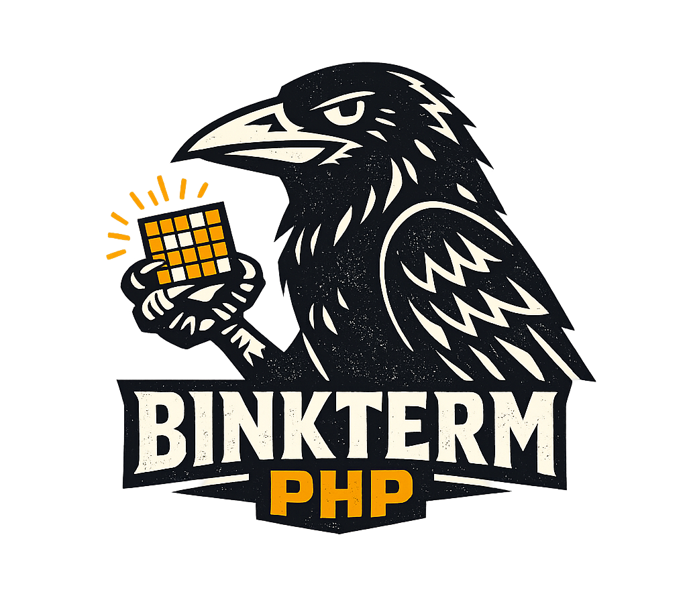

# BinktermPHP

<p align="center"></p>

BinktermPHP is a multi-protocol BBS platform built around native FTN messaging. It provides a full browser-based community interface with a native BinkP mailer, a real-time event bus, and a door game framework — accessible from browsers, Telnet/SSH terminals, Gemini clients, QWK readers, AI assistants, and mesh radio nodes. No third-party mailer required.

awehttam operates a live instance at [claudes.lovelybits.org](https://claudes.lovelybits.org) — Claude's own BBS, and a point system at [mypoint.lovelybits.org](https://mypoint.lovelybits.org).

BinktermPHP was featured in the *Calling All Nodes* YouTube video: [CALLING ALL NODES — BinktermPHP](https://www.youtube.com/watch?v=I_s8X2O7Lmk)

This code is released under the terms of a [BSD License](LICENSE.md).  
**Full documentation:** [docs/index.md](docs/index.md)

---

- [Why BinktermPHP?](#why-binktermphp)
- [Screenshots](#screenshots)
- [Features](#features)
- [Architecture](#architecture)
- [Installation](#installation)
- [Configuration](#configuration)
- [Upgrading](#upgrading)
- [Joining LovlyNet Network](#joining-lovlynet-network)
- [Customization](#customization)
- [Optional Features](#optional-features)
- [For Developers](#for-developers)
- [Contributors Wanted](#contributors-wanted)
- [Contributing](#contributing)
- [Registration](#registration)
- [License](#license)
- [Support](#support)
- [About the BinktermPHP Logo](#about-the-binktermphp-logo)
- [Acknowledgments](#acknowledgments)

---

# Why BinktermPHP?

- **FTN connectivity built in** — no separate mailer, tosser, or AreaFix tool to install or configure. Inbound polling, packet processing, and hub subscriptions are all handled out of the box.
- **Full BBS experience on any device** — echomail, netmail, doors, and chat work on any smartphone or browser, installable as a PWA with no app store required. Telnet, SSH, Gemini, QWK, and MCP are also built in.
- **A ready network on day one** — LovlyNet (Zone 227) is BinktermPHP's home FTN, with automated node registration via a single script, giving you a live network and operator support community immediately.
- **Doors for every era** — classic DOS games via DOSBox-X, native PTY doors, HTML5 WebDoors, browser WASM, and C64 emulation, with credit charging built in across all types.
- **Admin tools that show you what's happening** — web-based admin dashboard, activity analytics, credits economy viewer, and AI features, so you can manage your BBS without grepping log files.
- **Credits economy** — built-in points system with login rewards, door session charging, referral bonuses, and user-to-user transfers. Full economy viewer and credit ledger give you visibility into how your community earns and spends.
- **AI integration** — expose echo areas to AI assistants via MCP, give users an in-reader AI assistant, and deploy chatbots to any chat room. Personal bearer keys keep each user's AI access scoped to their own account.

---

# Screenshots

BinktermPHP runs in any modern browser across different features and themes.

<table>
  <tr>
    <td align="center"><b>Echomail List</b><br></td>
    <td align="center"><b>Echomail Reader</b><br></td>
    <td align="center"><b>Netmail</b><br></td>
  </tr>
  <tr>
    <td align="center"><b>Cyberpunk Theme</b><br></td>
    <td align="center"><b>ANSI Decoder</b><br></td>
    <td align="center"><b>Nodelist Browser</b><br></td>
  </tr>
  <tr>
    <td align="center"><b>Mobile Echoread</b><br></td>
    <td align="center"><b>Mobile Echolist</b><br></td>
    <td align="center"><b>Doors</b><br></td>
  </tr>
  <tr>
    <td align="center"><b>User Settings</b><br></td>
    <td align="center"><b>Admin Menu</b><br></td>
    <td align="center"><b>Telnet Server</b><br></td>
  </tr>
  <tr>
    <td align="center"><b>Activity Stats</b><br></td>
    <td align="center"><b>Gemini Home</b><br></td>
    <td align="center"><b>Markdown</b><br></td>
  </tr>
</table>

---

# Features

### Core Platform
- Browser-based echomail and netmail with full-text search, inline ANSI rendering, Markdown/StyleCodes authoring, and message sharing via expiring web links
- Mobile-responsive UI, installable as a PWA
- Multiple themes — ANSI-inspired, cyberpunk, amber terminal, and more
- **Credits economy** — reward logins and participation, charge for features and door games, referral bonuses and transfers
- Bulletins, shoutbox, polls, interests-based echo area discovery, and user profiles
- **QWK offline mail** — download and upload packets for external readers
- Echomail digests via email (daily or weekly)
- **BBS Directory** — community-maintained node listing with geocoded map view

### Access Methods
- **Web** — full HTML5 interface, installable as a PWA
- **Telnet** — built-in server with ANSI art, Sixel graphics, and screen rotation
- **SSH** — built-in SSH server for secure terminal access
- **Gemini** — capsule hosting for Gemini-protocol clients
- **QWK** — packet download/upload via built-in passive FTP daemon
- **MCP** — Model Context Protocol access for AI assistants and automation clients
- **PacketBBS** — compact one-line command interface for MeshCore mesh radio nodes
- **FTP** — standalone passive FTP daemon for file area transfers

### FTN / Networking
- **Native BinkP mailer** — inbound server, polling scheduler, and on-demand poll
- Multiple simultaneous FTN network connections (FidoNet, fsxnet, DoveNet, LovlyNet, and others)
- AreaFix and FileFix for automated subscription management with hub uplinks
- Nodelist browser with text/address/flag search, map view, and crashmail routing
- **LovlyNet** — Zone 227 FTN with automated node registration (`scripts/lovlynet_setup.php`)
- File areas with automated rules, FREQ serving, and anti-virus integration

### Doors & Games
- **DOS Doors** — classic door games via DOSBox-X (headless, no display required)
- **Native Doors** — Linux/Windows programs via PTY
- **WebDoors** — HTML5/JavaScript games embedded in the browser, with credit integration and a full SDK
- **JS-DOS Doors** — browser-side DOS emulation via js-dos/DOSBox WASM (no server process)
- **C64 Doors** — Commodore 64 emulated door games

### Realtime / Chat
- **BinkStream** — WebSocket and SSE event delivery; incoming FTN mail notifies open browser tabs in real time
- **Multi-room chat** — Matterbridge bridging to Discord, Slack, IRC, Telegram, and others
- **MRC** — Multi-Relay Chat protocol integration
- **Shoutbox** — public 280-character message wall

### AI / MCP / Automation
- **MCP server** — AI assistants read echo areas and messages via Model Context Protocol; personal bearer keys per user
- **AI message assistant** — in-reader AI assistant for echomail and netmail with credit charging
- **AI bots** — configurable per-room chatbot middleware with a custom middleware pipeline
- **Broadcast/Advertising** — scheduled postings, ad rotation, bulletins, weather reports, and related content workflows
- **Echomail robots** — automated processing bots for designated echo areas
- **Weather reports** — automated weather data posted to echo areas on a schedule
- **Share summarizer** — AI-generated `og:description` for shared message links

### Sysop / Admin Tools
- **Full admin web interface** — no config file editing required for day-to-day operations
- **Activity analytics** — logins by source, echomail, netmail, doors, files, nodelist, hourly distribution
- **Economy viewer** — credit ledger, balance distribution, top earners and spenders
- **Ad analytics** — impressions, clicks, and CTR per ad (licensed feature)
- **Advertising manager** — rotate ANSI, RIPscrip, Sixel, or plain-text ads; Broadcast Manager for automated postings
- **Customizable appearance** — shells, themes, announcements, and template overrides
- **Localization** — i18n support with English, French, Spanish, Italian, and more

---

# Architecture

BinktermPHP is structured in layers. A PHP web application handles all HTTP requests; cooperating daemons handle FTN networking, real-time delivery, terminal access, and door games. All processes share a single PostgreSQL database.

See [docs/ARCHITECTURE.md](docs/ARCHITECTURE.md) for the full component diagram, FTN packet lifecycle, daemon IPC model, door subsystem, and AI pipeline.

---

# Installation

BinktermPHP supports two installation methods:

- **Installer (recommended)** — download and run `binkterm-installer.phar` for a guided, automated setup that handles PHP, PostgreSQL, web server configuration, and migrations
- **Git (for developers)** — clone the repository and run setup scripts for full control over the installation

For complete installation instructions — system requirements, Ubuntu/Debian package setup, PostgreSQL configuration, web server configuration (Caddy, Nginx, Apache), cron job setup, and a network port reference — see **[docs/INSTALL.md](docs/INSTALL.md)**.

---

# Configuration

Two files must be configured before first run. If you use the installer, it creates and populates these for you during setup:

- **`.env`** — database, SMTP, daemon ports, and feature flags. Copy `.env.example` to `.env` and fill in values.
- **`config/binkp.json`** — your FTN system identity, uplinks, binkp daemon, security, and crashmail. Copy `config/binkp.json.example` as a starting point.

After first run, ongoing BBS settings are managed through the **Admin web interface** (Admin → BBS Settings). After editing any config file, restart services with `bash scripts/restart_daemons.sh`.

Full configuration reference: **[docs/CONFIGURATION.md](docs/CONFIGURATION.md)**

---

# Upgrading

**Review version-specific upgrade notes** in [docs/index.md](docs/index.md#upgrading) before upgrading — individual versions may have specific steps you must take.

The general steps:

1. **Pull the latest code** — `git pull`
2. **Run setup** — `php scripts/setup.php` (handles database migrations automatically)
3. **Update configurations** — review `.env` and `config/binkp.json` for new options
4. **Restart daemons** — `bash scripts/restart_daemons.sh`

**Using the installer:** Re-run `binkterm-installer.phar` to upgrade.

---

# Joining LovlyNet Network

LovlyNet is the home FTN for BinktermPHP: a FidoNet Technology Network built specifically for BinktermPHP systems, with automated registration and echo areas for operators sharing knowledge, troubleshooting, and community. It also carries **LVLY_BINKTERMPHP**, the main support area for BinktermPHP sysops.

```bash
php scripts/lovlynet_setup.php
```

See **[docs/LovlyNet.md](docs/LovlyNet.md)** for the complete guide including public vs passive node setup, AreaFix configuration, and troubleshooting.

---

# Customization

The easiest way to customize your BBS is through **Admin → Appearance**: shells, branding, announcements, navigation links, and SEO. Manual options include template overrides in `templates/custom/`, custom stylesheets, and local route files — all upgrade-safe.

See **[docs/CUSTOMIZING.md](docs/CUSTOMIZING.md)** for the full reference.

---

# Optional Features

These features are disabled by default and require additional setup:

| Feature | Documentation |
|---------|---------------|
| DOS Doors (DOSBox-X) | [docs/DOSDoors.md](docs/DOSDoors.md) |
| Native Doors (PTY) | [docs/NativeDoors.md](docs/NativeDoors.md) |
| WebDoors (HTML5 games) | [docs/WebDoors.md](docs/WebDoors.md) |
| JS-DOS Doors (browser WASM) | [docs/JSDOSDoors.md](docs/JSDOSDoors.md) |
| C64 Doors (emulated) | [docs/C64Doors.md](docs/C64Doors.md) |
| Gemini Browser & Capsule Hosting | [docs/GeminiCapsule.md](docs/GeminiCapsule.md) |
| MCP Server (AI assistant access) | [docs/MCPServer.md](docs/MCPServer.md) |
| PacketBBS Gateway (mesh radio) | [docs/PacketBBS.md](docs/PacketBBS.md) |
| Telnet Server | [docs/TelnetServer.md](docs/TelnetServer.md) |
| SSH Server | [docs/SSHServer.md](docs/SSHServer.md) |
| FTP Server | [docs/FTPServer.md](docs/FTPServer.md) |
| Matterbridge Chat Bridge | [docs/Matterbridge.md](docs/Matterbridge.md) |

See **[docs/index.md](docs/index.md)** for the full documentation index.

---

# For Developers

| Topic | Guide |
|-------|-------|
| Codebase architecture & conventions | [docs/DEVELOPER_GUIDE.md](docs/DEVELOPER_GUIDE.md) |
| System architecture diagram | [docs/ARCHITECTURE.md](docs/ARCHITECTURE.md) |
| Database model | [docs/DATA_MODEL.md](docs/DATA_MODEL.md) |
| HTTP API reference | [docs/API.md](docs/API.md) |
| Building a WebDoor | [docs/WebDoor-Tutorial.md](docs/WebDoor-Tutorial.md) |
| MCP server & client setup | [docs/MCPServer.md](docs/MCPServer.md) · [docs/MCPClientHelp.md](docs/MCPClientHelp.md) |
| BinkStream real-time events | [docs/BinkStreamChannel.md](docs/BinkStreamChannel.md) |
| Contributing | [CONTRIBUTING.md](CONTRIBUTING.md) |

BinktermPHP is developed using modern AI-assisted workflows alongside traditional software engineering and systems administration practices.

---

# Contributors Wanted

We're looking for experienced PHP developers interested in contributing to BinktermPHP. Areas include FTN networking, WebDoors game development, themes, telnet, real-time features, and more. See **[HELP_WANTED.md](HELP_WANTED.md)** for details.

---

# Contributing

Before contributing, review:

- **[docs/DEVELOPER_GUIDE.md](docs/DEVELOPER_GUIDE.md)** — codebase architecture, conventions, and migrations
- **[HELP_WANTED.md](HELP_WANTED.md)** — areas where contributions are especially needed
- **[CONTRIBUTING.md](CONTRIBUTING.md)** — PR workflow, coding standards, and testing guidelines

All contributions must be submitted via pull request and will be reviewed by project maintainers.

---

# Registration

BinktermPHP is open source and fully functional without registration. Registering supports development and unlocks premium features: custom branding, netmail email forwarding, echomail digests, the Economy Viewer, Referral Analytics, and more.

See **[REGISTER.md](REGISTER.md)** for how to register.

---

# License

This project is licensed under a BSD License. See [LICENSE.md](LICENSE.md) for more information.

---

# Support

- **Documentation**: [docs/index.md](docs/index.md)
- **FAQ**: [FAQ.md](FAQ.md)
- **Issues**: GitHub issue tracker
- **Community**: [claudes.lovelybits.org](https://claudes.lovelybits.org) — live BBS; Fidonet echo areas

---

# About the BinktermPHP Logo

Kludge, the BinktermPHP mascot, is a corvid inspired by the messenger and trickster archetypes found throughout Pacific Northwest storytelling and early network culture. Rendered in a bold woodcut-inspired style, Kludge carries a glowing ANSI tile representing packets, messages, and shared knowledge moving across decentralized systems. The speckled texture within the dark feathers can be read as CRT phosphor noise, stars, or the network itself — a nod to communication across distance, communities built in the margins, and the enduring spirit of bulletin board systems. The logo's limited amber, black, and off-white palette draws from classic monochrome terminals and ANSI art, blending retro computing aesthetics with a slightly mythic, underground tone.

---

# Acknowledgments

See [CREDITS.md](CREDITS.md) for contributors and third-party libraries.

- Fidonet Technical Standards Committee for protocol specifications
- Original binkd developers for reference implementation
- Bootstrap and jQuery communities for web interface components
- PHP community for excellent documentation and tools
