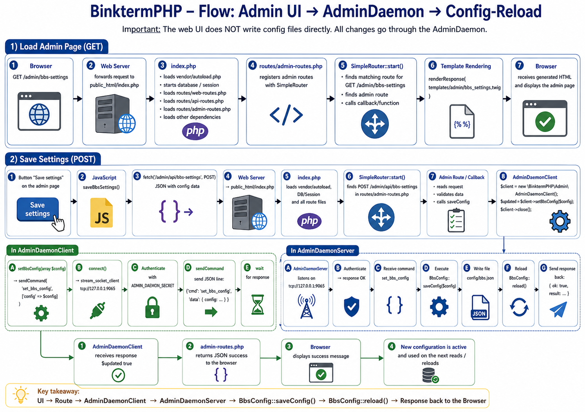

# Admin Daemon

The Admin Daemon (`scripts/admin_daemon.php`) is a long-running privileged process that acts as the single owner of config files, log files, and system operations that the PHP web process (running under php-fpm) cannot perform directly. The web process communicates with it over a local socket.

---

## Why It Exists

php-fpm web workers run as an unprivileged user with restricted filesystem access. They cannot write config files, write to log files managed by other processes, send signals to other daemons, or fork subprocesses safely. The Admin Daemon solves this by:

- Running as a privileged user that owns the relevant files and processes
- Accepting authenticated JSON commands over a local TCP or Unix socket
- Executing the requested operations and returning structured results

---

## Architecture

```
Web process (php-fpm)                Admin Daemon (admin_daemon.php)
─────────────────────                ──────────────────────────────
AdminDaemonClient ──TCP/Unix──▶ AdminDaemonServer
                  ◀──────────── JSON response

Logger (fallback) ──UDP──────▶ AdminDaemonServer (UDP log listener)
```

The daemon binds two sockets on the same port:
- **TCP** (or Unix): authenticated command channel
- **UDP** (same host:port): fire-and-forget log channel used as a fallback when the Logger cannot write a log file directly

On Linux/macOS the daemon forks a child process for each client connection so long-running commands (e.g. binkp polls) do not block the accept loop. On Windows, commands are handled synchronously.

---

## Configuration

| Environment Variable | Default | Description |
|---|---|---|
| `ADMIN_DAEMON_SECRET` | _(required)_ | Shared secret used to authenticate clients |
| `ADMIN_DAEMON_SOCKET` | `tcp://127.0.0.1:9065` | Socket target (`tcp://host:port` or `unix:///path.sock`) |
| `ADMIN_DAEMON_PID_FILE` | `data/run/admin_daemon.pid` | PID file path |
| `ADMIN_DAEMON_SOCKET_PERMS` | _(none)_ | Octal permissions to apply to a Unix socket (e.g. `0660`) |

Unix sockets are not supported on Windows; use a `tcp://` target there.

---

## Starting the Daemon

```bash
# Foreground (development)
php scripts/admin_daemon.php

# Background (production)
php scripts/admin_daemon.php --daemon

# Common options
php scripts/admin_daemon.php \
  --socket=tcp://127.0.0.1:9065 \
  --secret=mysecret \
  --log-level=DEBUG \
  --pid-file=data/run/admin_daemon.pid \
  --daemon
```

| Option | Description |
|---|---|
| `--socket=TARGET` | Override socket target |
| `--secret=SECRET` | Override `ADMIN_DAEMON_SECRET` |
| `--log-file=FILE` | Log file path (default: `data/logs/admin_daemon.log`) |
| `--log-level=LEVEL` | `DEBUG`, `INFO`, `WARNING`, `ERROR`, `CRITICAL` |
| `--no-console` | Suppress console output |
| `--pid-file=FILE` | PID file path |
| `--socket-perms=MODE` | Unix socket permissions (octal) |
| `--daemon` | Fork into background (requires `pcntl`) |

---

## Wire Protocol

All communication is newline-delimited JSON over a persistent TCP (or Unix) connection.

### Authentication

The first message sent by the client must be an auth frame:

```json
{"auth": "shared-secret-value"}
```

The server responds:

```json
{"ok": true}
```

If authentication fails, the server responds with `{"ok": false, "error": "unauthorized"}` and closes the connection.

### Commands

After authentication, the client sends one command per connection:

```json
{"cmd": "command_name", "data": { ... }}
```

The server responds:

```json
{"ok": true, "result": { ... }}
```

On error:

```json
{"ok": false, "error": "error_description"}
```

The client closes the connection after receiving the response (one command per connection).

### UDP Log Packets

The daemon also listens on the same host:port over UDP for log messages from processes that cannot make a TCP connection. The binary packet layout is:

| Field | Type | Description |
|---|---|---|
| Timestamp | uint64 big-endian | Unix time in milliseconds |
| Level | uint8 | 0=DEBUG, 1=INFO, 2=WARNING, 3=ERROR |
| PID | uint32 big-endian | Sending process ID |
| Filename length | uint8 | Length of log filename |
| Filename | bytes | Log filename (e.g. `server.log`) |
| Message length | uint16 big-endian | Length of message |
| Message | bytes | Pre-formatted log line (max 1200 bytes) |

Only filenames in `AdminDaemonServer::UDP_ALLOWED_LOG_FILES` are accepted:

- `server.log`
- `packets.log`
- `multiplexing-server.log`
- `binkp_poll.log`
- `binkp_server.log`
- `binkp_scheduler.log`
- `admin_daemon.log`
- `mrc_daemon.log`
- `ai_bot_daemon.log`
- `crashmail.log`
- `dosdoor.log`
- `packetbbs.log`

When adding a new log file that needs UDP fallback support, add its basename to that constant.

---

## AdminDaemonClient

`src/Admin/AdminDaemonClient.php` is the PHP client used by web routes and CLI scripts to communicate with the daemon.

### Instantiation

```php
$client = new \BinktermPHP\Admin\AdminDaemonClient();
// Uses ADMIN_DAEMON_SOCKET and ADMIN_DAEMON_SECRET from environment.

// Or override:
$client = new \BinktermPHP\Admin\AdminDaemonClient('tcp://127.0.0.1:9065', 'mysecret');
```

### One-shot logging shortcut

For simple log-and-forget use from a static context:

```php
AdminDaemonClient::log('WARNING', 'Something happened', ['user_id' => 42]);
// Falls back to error_log() if the daemon is unreachable.
```

### Closing the connection

```php
$client->close();
```

The client automatically closes after each `sendCommand()` call. Call `close()` explicitly only when you hold the client across multiple calls and need to release the socket.

---

## Command Reference

### Packet Processing

| Command (client method) | Description |
|---|---|
| `processPackets()` | Run `scripts/process_packets.php` synchronously |
| `crashmailPoll()` | Run `scripts/crashmail_poll.php` synchronously |

### Binkp Polling

| Command (client method) | Description |
|---|---|
| `binkPoll(string $upstream)` | Spawn `binkp_poll.php` in background; returns immediately. Pass `'all'` for all uplinks. |
| `binkPollSync(string $upstream)` | Run `binkp_poll.php` synchronously; waits for completion |
| `binkpAuthTest(string $domain)` | Test binkp authentication for an uplink by domain name |
| `binkpAuthTestAddress(string $address)` | Test binkp authentication for an uplink by address |
| `reloadBinkpConfig()` | Send SIGHUP to the running binkp server to reload its config |

### Configuration — BBS & System

| Command (client method) | Description |
|---|---|
| `getBbsConfig()` | Read `data/bbs.json` |
| `setBbsConfig(array $config)` | Write `data/bbs.json` |
| `getSystemConfig()` | Read the `system` section of `config/binkp.json` |
| `setSystemConfig(array $config)` | Write the `system` section of `config/binkp.json` |
| `getBinkpConfig()` | Read the `binkp` section of `config/binkp.json` |
| `setBinkpConfig(array $config)` | Write the `binkp` section of `config/binkp.json` |
| `getFullBinkpConfig()` | Read all sections of `config/binkp.json` |
| `setFullBinkpConfig(array $config)` | Write all sections of `config/binkp.json` (deep-merges with existing) |
| `saveLovlyNetConfig(string $json)` | Write `config/lovlynet.json` |
| `getAppearanceConfig()` | Read appearance/theme settings |
| `setAppearanceConfig(array $config)` | Write appearance/theme settings |
| `getMrcConfig()` | Read MRC daemon config |
| `setMrcConfig(array $config)` | Write MRC daemon config |
| `getMatterbridgeConfig()` | Read Matterbridge config |
| `setMatterbridgeConfig(array $config)` | Write Matterbridge config |
| `getWeatherConfig()` | Read `config/weather.json` |
| `saveWeatherConfig(string $json)` | Write `config/weather.json` |

### Doors Configuration

| Command (client method) | Description |
|---|---|
| `getWebdoorsConfig()` | Read WebDoors configuration |
| `saveWebdoorsConfig(string $json)` | Write and apply WebDoor manifest config |
| `activateWebdoorsConfig()` | Activate pending WebDoors config changes |
| `getJsdosdoorsConfig()` | Read JS-DOS doors configuration |
| `saveJsdosdoorsConfig(string $json)` | Write JS-DOS doors configuration |
| `activateJsdosdoorsConfig()` | Activate pending JS-DOS config changes |
| `getDosdoorsConfig()` | Read DOS doors configuration |
| `saveDosdoorsConfig(string $json)` | Write DOS doors configuration |
| `getNativeDoorsConfig()` | Read native doors configuration |
| `saveNativeDoorsConfig(string $json)` | Write native doors configuration |
| `saveJsdosSharedFile(string $gameId, string $dosPath, string $contentB64, bool $deleted)` | Write a shared JS-DOS save file (admin-only mode) |

### Content & Templates

| Command (client method) | Description |
|---|---|
| `getTaglines()` | Read taglines config |
| `saveTaglines(string $text)` | Write taglines |
| `listCustomTemplates()` | List available custom Twig template overrides |
| `getCustomTemplate(string $path)` | Read a custom template file |
| `saveCustomTemplate(string $path, string $content)` | Write a custom template file |
| `deleteCustomTemplate(string $path)` | Delete a custom template file |
| `installCustomTemplate(string $source, bool $overwrite)` | Install a template from a source path |
| `getFileAreaRulesConfig()` | Read file area automation rules |
| `saveFileAreaRulesConfig(string $json)` | Write file area automation rules |

### Terminal Screens & Art

| Command (client method) | Description |
|---|---|
| `listShellArt()` | List uploaded shell art files |
| `uploadShellArt(string $contentBase64, string $name, string $originalName)` | Upload a shell art file |
| `deleteShellArt(string $name)` | Delete a shell art file |
| `listTerminalScreens()` | List terminal screen files |
| `getTerminalScreen(string $key)` | Read a terminal screen by key |
| `saveTerminalScreen(string $key, string $content)` | Write a terminal screen |
| `uploadTerminalScreen(string $key, string $contentBase64, string $originalName)` | Upload a terminal screen |
| `deleteTerminalScreen(string $key)` | Delete a terminal screen |
| `listSixelScreens()` | List Sixel screen files |
| `getSixelScreen(string $key)` | Read a Sixel screen by key |
| `uploadSixelScreen(string $key, string $contentBase64, string $originalName)` | Upload a Sixel screen |
| `deleteSixelScreen(string $key)` | Delete a Sixel screen |

### Content Pages

| Command (client method) | Description |
|---|---|
| `setSystemNews(string $text)` | Write system news content |
| `setHouseRules(string $text)` | Write house rules content |
| `setLoginSplash(string $text)` | Write login splash text |
| `setLoginAnsi(string $text)` | Write login ANSI art |
| `setRegisterSplash(string $text)` | Write registration splash text |

### Logging

| Command (client method) | Description |
|---|---|
| `getLogs(int $lines)` | Return the last N lines from all daemon log files |
| `serverLog(string $level, string $message, array $context)` | Append an entry to `server.log` via the daemon |
| `udpLog(string $logFile, string $level, string $message)` | Send a log line via UDP (best-effort, low overhead) |

### i18n Overlays

| Command (client method) | Description |
|---|---|
| `getI18nOverlay(string $locale, string $namespace)` | Read the base catalog keys and any site-level override overrides for a locale/namespace |
| `saveI18nOverlay(string $locale, string $namespace, array $overrides)` | Write override entries; pass empty array to clear all |

### License

| Command (client method) | Description |
|---|---|
| `setLicense(array $licenseData)` | Write `data/license.json` |
| `deleteLicense()` | Delete `data/license.json`, reverting to Community Edition |

### Daemon Control

| Command (client method) | Description |
|---|---|
| `restartMrcDaemon()` | Stop and restart the MRC daemon |
| `stopServices()` | Stop all managed services and shut down the admin daemon |

### File & Content Operations

| Command (client method) | Description |
|---|---|
| `scanFile(int $fileId)` | Run an on-demand virus scan for a file by database ID |
| `runEchomailRobot(int $robotId)` | Run an echomail robot by ID (with `--debug` output) |
| `reindexIso(int $areaId)` | Spawn a background re-index of an ISO-backed file area |
| `rehatchFile(int $fileId)` | Re-hatch a single file via `scripts/file_hatch.php` |

---

## Configuration Save Pattern

Any admin setting that writes a config file follows the same flow. The web process cannot write config files directly — it delegates the write to the daemon and then triggers a reload.



### GET: loading settings into the admin UI

1. The browser requests an admin page (e.g. `/admin/binkp-config`).
2. The PHP route calls the appropriate `AdminDaemonClient` getter (e.g. `getBinkpConfig()`).
3. The daemon reads the config file and returns the current values.
4. The route passes the values to a Twig template, which renders the form.

### POST: saving settings from the admin UI

1. The browser submits the form via an AJAX POST to an admin API endpoint.
2. The PHP route validates and normalises the incoming data.
3. The route calls the appropriate `AdminDaemonClient` setter (e.g. `setBinkpConfig($data)`).
4. The daemon writes the config file and, where applicable, signals the affected daemon to reload (e.g. sending SIGHUP to `binkp_server`).
5. The daemon returns the saved config, which the route echoes back as JSON.
6. The browser displays a success confirmation.

### Example

```php
// Route handler (routes/admin-routes.php)
SimpleRouter::post('/api/binkp-config', function () {
    RouteHelper::requireAdmin();
    $data = json_decode(file_get_contents('php://input'), true);
    $client = new AdminDaemonClient();
    $result = $client->setBinkpConfig($data);
    $client->close();
    echo json_encode(['ok' => true, 'config' => $result]);
});
```

```php
// AdminDaemonServer::handleCommand() — 'set_binkp_config' case
$binkpConfig = BinkpConfig::getInstance();
$binkpConfig->setBinkpConfig(/* fields from $data */);
$this->writeResponse($client, ['ok' => true, 'result' => $binkpConfig->getBinkpConfig()]);
```

The key invariant is that **no route or controller ever calls `file_put_contents()` on a config file directly** — the daemon is the sole writer.

---

## Adding a New Command

1. Add a public method to `AdminDaemonClient` that calls `$this->sendCommand('my_command', [...])`.
2. Add a `case 'my_command':` branch in `AdminDaemonServer::handleCommand()`.
3. If the command writes a new log file, add the filename to `AdminDaemonServer::UDP_ALLOWED_LOG_FILES`.
4. If the command needs to spawn a subprocess, use `$this->spawnCommand([...])` for fire-and-forget or `$this->runCommand([...])` to wait for output.

---

## Logging from Web Routes

Web routes must not write log files directly. Use one of these patterns:

```php
// Preferred — uses the Logger class which falls back to UDP automatically
getServerLogger()->info('User sent netmail', ['user_id' => $userId]);

// Alternative — one-shot static call directly to the daemon
AdminDaemonClient::log('INFO', 'Something happened', ['context' => 'value']);
```

See `CLAUDE.md` and `docs/ARCHITECTURE.md` for the full logging policy.
